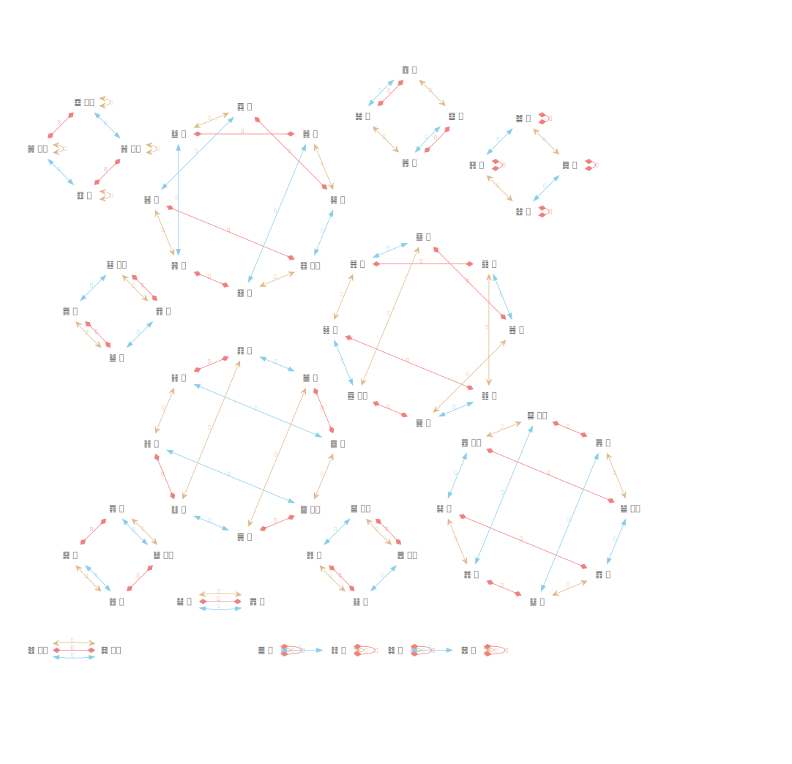

错卦：六爻皆变得到的卦。

综卦：亦称覆卦，上下颠倒的卦。
特殊的综卦：综卦为自身的卦，特点是上下对称，包括由八卦中的对称卦组成的纯卦4个，以及由八卦中两两对称的卦组成的卦4个，共8个，包括 ䷀ 乾、 ䷁ 坤、䷚ 颐、䷛ 大过、 ䷜ 坎、 ䷝ 离、䷼ 中孚 、䷽ 小过。

交卦：指上下卦互。
特殊的交卦：交卦为自身的卦，包括上下卦相同的8纯卦。䷀ 乾、 ䷁ 坤、䷜ 坎、 ䷝ 离、 ䷲ 震、䷳ 艮、䷸ 巽、䷹ 兑。

### 卦群

错卦、综卦、交卦的三种关系，形成一些相互关联的特殊的群，一共14个群。包括
+ 2卦群：共4个。
+ 4卦群：6个。
+ 8卦群：4个。

三种关系，如果没有任何重复，应该是8个一组，由于卦画的各种特殊关系，很多关系对应相同的卦，就形成了不同的卦群。

#### 2卦群
对称、纯卦，综卦、交卦都是自身，错卦是对方，包括两组
+ ䷀ 乾 ䷁ 坤
+ ䷜ 坎 ䷝ 离
非纯卦，乾和坤、坎和离组成，错卦、综卦、交卦都是对方，包括两组
+ ䷊ 泰 ䷋  否
+ ䷾ 既济  ䷿ 未济

#### 4卦群
单卦对称的卦(乾、坤、坎、离)组成的其他的卦，交卦和综卦相同，错卦不同，共2组
+ ䷆ 师 ䷇ 比 ䷌ 同人 ䷍ 大有
+ ䷄ 需 ䷅ 讼 ䷢ 晋  ䷣ 明夷

其他纯卦，交卦是自身，错卦、综卦不同，共1组：
+   ䷲ 震 ䷳ 艮 ䷸ 巽 ䷹ 兑

其他对称的卦，综卦为自身，共1组：
+  ䷚ 颐 ䷛ 大过 ䷼ 中孚䷽ 小过

艮、巽、震、兑组成，错挂和互卦相同，共2组
+ ䷞ 咸 ䷟ 恒  ䷨ 损 ䷩ 益
+ ䷐ 随 ䷑ 蛊 ䷴ 渐 ䷵ 归妹

#### 8卦群

交、错、综卦都不是自身，也不相同，共4组
+ ䷂ 屯 ䷃ 蒙  ䷤ 家人 ䷥ 睽 ䷦ 蹇 ䷧ 解  ䷰ 革 ䷱ 鼎：坎、离、艮、巽、震、兑的组合。2阴4阳或2阳4阴。
+ ䷒ 临 ䷓ 观 ䷘ 无妄 ䷙ 大畜 ䷠ 遯  ䷡ 大壮 ䷬ 萃 ䷭ 升：乾、坤、艮、巽、震、兑的组合。2阴4阳或2阳4阴。
+ ䷈ 小畜 ䷉ 履 ䷎ 谦 ䷏ 豫  ䷖ 剥 ䷗ 复  ䷪ 夬 ䷫ 姤 ：乾、坤、艮、巽、震、兑的组合。1阴5阳或1阳5阴。
+ ䷔ 噬嗑 ䷕ 贲 ䷮ 困 ䷯ 井  ䷶ 丰 ䷷ 旅  ䷺ 涣 ䷻ 节：坎、离、艮、巽、震、兑的组合。3阴3阳。

