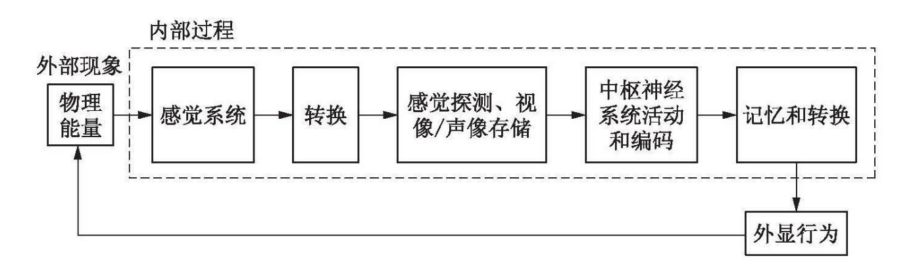
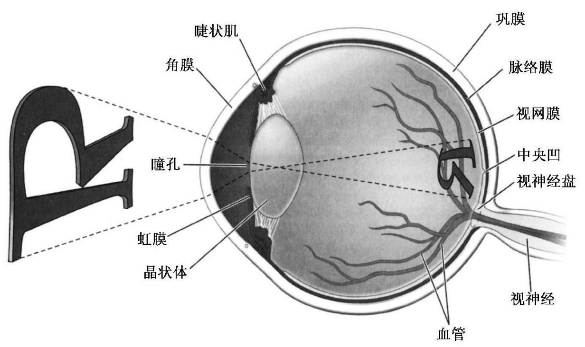
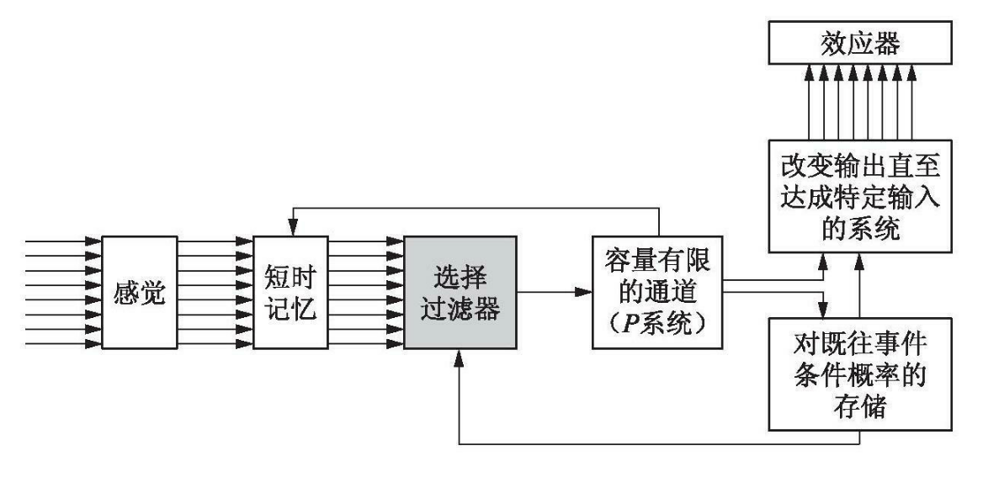
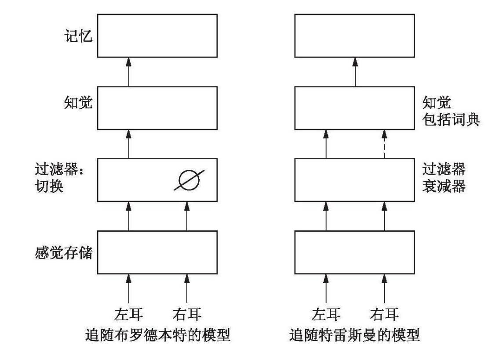

## 计算式大脑

我们对外部世界的感知是通过**脑和周围神经系统**进行的，周围神经系统是由除了脑和脊髓以外的神经构成的，其功能是感觉和知觉。

**计算式大脑** ：心灵是由具有计算功能的器官组成的一个系统，用来理解外部世界，对信息进行加工。包括对刺激的编码、对信息的存储、对材料的转换、思考最后形成知识。我们的高级认知活动都是某种类型的计算。

根据计算式大脑的观念，研究者提出了一个信息加工阶段的模型，要注意，这个模型只是一种**假设**，脑的结构未必按这种方式组织，这一模型的价值在于形象的阐述了认知心理学假定的信息加工诸阶段，心理学家能够在加工信息的过程中看到脑部的活动状态。

## 感觉与知觉

物理世界(外部)和心理世界(内部)的交接之处就是感觉系统。

**感觉**：对物理世界的能量的初始探测，即对刺激的感知。

**知觉**：对感觉到的事物的解释。每一个感觉事件都是在我们关于世界的知识、文化、预期，甚至当时我们和谁在一起这些背景下得到加工处理的。这一切都为单纯的感觉体验赋予了意义——这就是知觉。

五种感觉

| 感觉 | 结构 | 外部刺激 | 感受器         |
| ---- | ---- | -------- | -------------- |
| 视觉 | 眼睛 | 光波     | 视杆和视锥细胞 |
| 听觉 | 耳朵 | 声波     | 毛细胞         |
| 味觉 | 鼻子 | 化学物质 | 味蕾           |
| 嗅觉 | 舌头 | 化学物质 | 毛细胞         |
| 触觉 | 皮肤 | 压力     | 神经细胞       |

### 视觉

**视觉**(vision)是感受一小段称为光的电磁波，眼睛的独特结构使视觉成为可能。光线通过**角膜**(cornea)和**晶状体**(lens)进入眼睛，然后在**视网膜**(retina)上成像。不管是二维还是三维、黑白还是彩色的形状和模式，都以二位的形式呈现在视网膜上。视网膜上的视神经感觉到这些二维表征后，将神经冲动沿着视觉通路传到**视觉皮层**(visual cortex)，产生高阶知觉。若再结合已有的知识经验，就可以进行识别。

视觉系统是所有感觉系统中最复杂的，人眼有700万个**视锥细胞**(cones) 和1.25亿个**视杆细胞**(rods)，二者的分布并不均匀，视锥细胞集中在**中央凹**(fovea)附近，对高强度的光刺激敏感，主要负责颜色和精细视觉。视杆细胞的分布远离中央凹，对低强度的刺激敏感。

值得注意的是，视网膜上的视觉体验是二维的且没有颜色的，只是将电磁波转化为电化学信号，这是大脑的语言。到视觉皮层结合后，才会产生三维和颜色。

### 错觉

**错觉**：我们的感觉系统所接收的内容和我们的心灵所解释的结果之间的差异。

研究外部世界物理属性的改变与相应的心理体验之间的关系的学科，称为**心理物理学**(psychophysics)。心理物理学家会测量同一感觉刺激的物理属性和心理属性。有时事实和知觉并不一致，错觉现象就是如此。错觉对于心理物理学家来说很重要，不是因为它们指出了我们知觉能力上的缺陷，而是因为它们给我们提供了有关“知觉系统如何运作”的更深入的了解。

我们知觉来自外部世界的初始信息的方式，既受到感觉系统和脑的最初构造方式的影响(硬件)，又受制于我们过去的经验，它赋予刺激的初始感觉体验丰富多彩的意义。

我们的知觉会依赖于先前的经验和预期，考察知觉表现是如何依赖于预期的理论称为**信号检测论**。

### 感觉-脑的先天禀赋

感觉系统是由五种感觉的感受器和联结的神经元构成的。

如果神经受到了刺激，它们会被知觉为来源于那些与之有关的特定神经。这也就是为什么重击后脑勺会产生“眼冒金星”的感觉。

如果我们把感觉系统看成通往外部世界的窗户，只有被感受器探测到并传递的那些感觉，才能进行更高级的加工和处理。由于感觉系统的接收能力是有限的，我们的知识也必然是有限的。我们有可能过分强调了物质世界中能够被我们探测到的那些属性的意义，却低估了我们不能察觉，或者需要通过特殊的载体加以转换才能察觉的那些属性的重要性。因为我们通过如此有限的渠道来理解现实世界，所以不得不承认，我们所知的一切都是谬误的。

感觉的探测和解释取决于感觉系统和脑所感知到的刺激能量和先前存储在记忆当中的知识。

## 知觉广度

**知觉广度**：我们在一次短暂呈现中能够感受到的信息量。

两种假设的结构：**感觉存储**和**短时记忆**。

**感觉存储**：我们对感觉到的未经加工的初始信息的存储，这些存储的信息会被快速遗忘。可以基于感觉存储进行快速决策。

研究者进行研究的感觉存储包括

+ 视觉存储：视觉印象的持续和一段时间内可供进一步加工的现象称为**视像记忆**。视像存储本质上是视野内大量事物的快照。这些快照的作用在于让大脑的加工赶得上眼睛接受视觉信息的速度。视像存储一般会持续250毫秒-4秒。
+ 声像存储：听觉印象的短期存储，使我们拥有更多的时间来聆听听觉信息。一般也是持续250毫秒—4秒之间。在言语、音乐或其他声音中任何一个小片段所包含的信息都是没有意义的，除非将它们置于其他声音的背景之内。声像存储通过短暂地保留听觉信息，就像“胶水”一样将我们的听觉世界连接在一起。
+ 触觉中也有类似的存储机制。

关于感觉存储的功能，一些研究者认为，对来自外部物理世界的信息提取遵循**节省法则**。由于激发我们神经系统的感觉信息的数量大到天文数字，而高级认知系统的加工能力有限，因此只有一小部分感觉信息能够被选取出来进行进一步加工。视像存储、声像存储和其他感觉信息的存储，使我们只需抽取有待进一步加工的信息。

短时感觉存储机制的发展可能是进化过程中的一个基本的组成部分。它们作为生存机制的功能纯粹是推测的，但是看似合理的是，它们使我们能够知觉“一切”而又只注意我们的知觉中那些必不可少的部分，这构成了进化过程中最为经济的系统。感觉存储使我们有时间提取至关重要的特征作进一步加工和做出行动。

## 注意

詹姆斯对注意的定义：它是心灵以清晰生动的形式，从若干个同时出现的可能对象或思想序列中选择其一而加以处理的过程。集中性，即意识的集中，是它的本质。它意味着从一些事物中退出，以便更好地处理另一些事物。

认知心理学的**注意**(attention)的定义：**心理能量在感觉事件或心理事件上的集中**。从周围世界中选择重要的信息(通过我们的五官)，以便我们的大脑不至于超载海量信息。

在任何给定的时刻，我们周围可获得的线索数不胜数。但是我们的神经加工能力是有限的，无法感知全部的外部刺激；而且，就算这些刺激被探测到了，脑也无法对它们全部加以处理，我们的信息处理能力太有限了。人们的传统观点认为注意一个线索的代价是忽略其他线索。我们对某些环境线索的注意优先于其他线索，被注意到的线索通常会受到进一步的加工处理，而未被注意的线索则不会。注意什么不注意什么，似乎源自我们对当时情境所施加的控制以及源自我们的长时经历。

### 选择性注意

我们会选择性的关注一些线索，选择性的原因

+ 我们的信息处理能力受限于**通道容量**(互联网带宽的隐喻)
+ 我们对选择哪些特征加以注意施加了一定的控制。
+ 我们对事件的知觉与对刺激材料的自动加工有关。
+ 神经基础研究表明，人脑的注意系统独立于脑的其他系统。

**阈下知觉**(subliminal perception)：**阈限**被认为是感觉阈限，即刺激在该水平刚好能被知觉到。字面意思来看，阈下是指在感觉阈限之下，因此无法知觉。但是，阈下知觉通常是指刺激强度明显超出心理阈限，但是还未进入意识，技术上是指阈限之上。

阈下知觉广泛应用与商业广告中，但是阈下知觉是否有效还是有争议的，很多人认为这是伪科学。但是，也有研究证明，阈下知觉与**启动效应**密切相关(在启动现象中，呈现一个单词，会使得识别与之存在关联的事物更加容易，而当事者对这一过程没有任何意识)，阈下刺激能够影响对后续刺激的识别。

我们仅仅有选择性地注意所有可利用的线索中的一部分，人们常常将这种选择性归结为通道容量的不足，即我们没有能力同时处理所有的感觉线索。除了感觉系统的局限之外，在认知能力方面似乎也存在局限。

选择性注意的模型

**过滤器模型**： 由布罗德本特提出。基本假设是信息加工受通道容量的限制，该观点最初见于香农和韦弗的信息加工理论。

我们的注意会形成一种选择过滤器，对于通过并行的神经通道传递到脑中的信号进行过滤，过滤后的信号被传递到一个容量有限的通道，再进行进一步的加工。

布罗德本特采用**双耳分听任务**来检验他的理论。

过滤器模型无法解释人们能从非注意通道中探寻有意义的信息这一事实。

为了解决这个问题，特雷斯曼提出了**衰减器模型**，筛查过程的第一步是根据粗略的物理特征对信息进行评估，然后由更为缜密的筛查过程根据意义对信号进行评估。初始筛查过程发生的机制是衰减器或知觉过滤器——一种调节信息的强度并且协调信号及其语言加工之间关系的装置。特雷斯曼的模型意味着“无关信息”进入的是一只“迟钝”的耳朵，而不是完全失聪的耳朵。

两种模型的比较

特雷斯曼和朱利斯都假定，在视觉注意中有两个不同的过程在发挥作用。在第一个阶段，存在一个初级的前注意加工（对影像的一种映象），该过程对视野进行扫描，迅速地检测客体的主要特征，如大小、颜色、方向和运动等等。根据特雷斯曼的观点，此后，位于大脑皮层不同区域的特定的**特征地图**对客体的不同属性进行编码。

关于过滤器何时发生作用，布罗德本特和特雷斯曼都把过滤器放在知觉过程的前面。也有些研究者把过滤器移动到分析阶段，这样可以解释阈下知觉的问题。

### 自动加工

高度熟练的动作会变得自动化，因而与完成新的或不太熟练的动作相比，所需的注意力较少。

波斯纳和施奈德描述了自动化过程的三个特征：

+ 一个自动化过程可以在无意中进行。
+ 自动加工在意识的范围之外。
+ 自动化过程很少或根本不消耗意识资源。

复杂的认知活动中的一部分似乎发生于意识经验之外。熟练地完成这些任务，可以将意识解放出来，去注意那些要求更高、更易变化也更需要注意的活动的冲击。

## 注意的认知神经科学

似乎存在着在解剖结构上相互分离的脑系统，分别司职注意和其他系统，如数据加工系统，后者即使在注意已经指向别处的情况下，还能对特定的输入信息进行处理。从某种意义上说，注意系统与其他系统（如运动和感觉系统）的相似之处在于，它与脑的其余部分产生相互作用，但同时又保持着自身的独特性。

