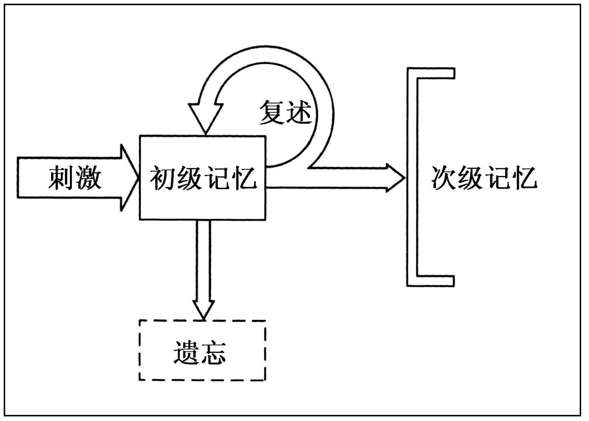
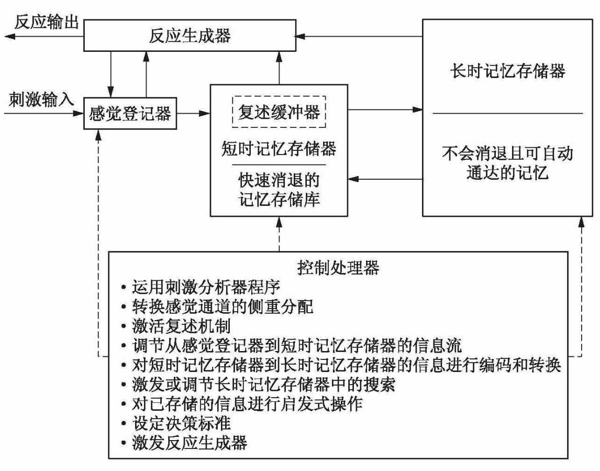
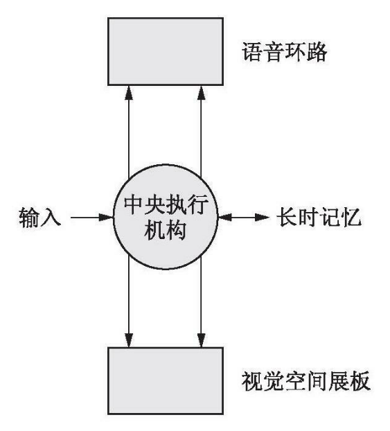

## 记忆的二元模型

詹姆斯最早提出了记忆的二元模型，他是在内省的基础上建立这个模型的，把记忆分为两部分

+ 初级记忆：也就是**短时记忆**短时记忆（short-term memory，STM) 对刚察觉到的事物的记忆。
+ 次级记忆：也就是**长时记忆**(long-term memory，LTM) 长时间保存的记忆。

一些信息首先进入初级记忆，而后可能通过复述留存于此，也可能被遗忘。通过复述，信息可能会进入长时记忆，成为永久记忆的一部分。

记忆的二元模型后来也得到了实证研究的支持。

玛丽·卡尔金斯发现了**首因和近因效应**：对单词进行记忆时，在词表开头的以及在词表结尾的回忆成绩最好。二元模型可以很好的解释这个效应，在记忆时，短期记忆是有容量限制的，新进入的信息会覆盖原有的信息。开头的单词被复述多次而进入长时记忆，结尾的单词刚学到，还未被覆盖，保留在短时记忆中。因此，开头和结尾的单词回忆成绩最好。

也有一个相反的**雷斯多夫效应**，该效应指的是当某个字母处在列表的当中，但它相比其他项目是新异的，则这个项目更容易被记住。

实验还可以推测短期记忆的存储容量，大概是8个项目。

沃与诺曼提出了记忆二元模型的行为心理学表述，他把记忆看成脑袋中一个个的盒子。短期记忆的容量是有限的，就像一个个的存储隔间，信息被存储与一个个插槽中，如果插槽都满了，新的信息就会覆盖某个插槽中的信息。

沃与诺曼还用实验验证了短期记忆的遗忘并不是因为消退，而是因为新信息的覆盖，即干扰。

阿特金森与希夫林在沃与诺曼的二元模型的基础上，提出了更多的次级系统，他们认为，记忆有三个存储机制：

+ 感觉登记器：一项刺激内容会以其感觉维度即时登记，然后要么遗失，要么被传递到进一步的加工阶段。
+ 短时存储器：工作系统，进入该系统的信息会快速消退并消失。
+ 长时存储器：被看做相对永恒的存在，长时存储器的功能在于监视感觉登记器中的刺激，并为来自短时存储器的信息提供存储空间。

## 短时记忆

短时记忆与感觉存储的区别

| 结构     | 编码                     | 容量        | 持续时间           | 提取              | 无法回忆的原因   |
| -------- | ------------------------ | ----------- | ------------------ | ----------------- | ---------------- |
| 感觉存储 | 感觉特征                 | 12-20个项目 | 250毫秒-4秒        | 完全提取          | 掩蔽或消退       |
| 短时记忆 | 经过识别和命名的感觉特征 | 7+-2个项目  | 12秒，复述后会增加 | 35毫秒提取1个项目 | 替代、干扰、消退 |

彼得森夫妇用一种特殊的方法**布朗-彼得森技术**测量了短期记忆的持续时间，是关于短时记忆实验理论的一个转折点。

他们让实验者听到由三个字母组成的字符串(如JQD)，然后得到一个三位数(如506)， 然后开始倒数3(506，503，500...)，可以防止他们对字符串复述，还可以控制倒数的持续时间。过一段时间后，让参与者回忆最开始听到的字符串。可以得到短期记忆的保存时长。

后来的认知神经科学家，根据切除了颞叶和海马体(被认为是长期记忆的加工处理位置)的病人的研究，以及对短时记忆出了问题的患者的研究，从神经学上证明了短期记忆和长期记忆的分离，是两个不同的加工过程。被称为双重分离现象。

巴德利基于上述研究，对二元记忆模型进行了改进，提出了**工作记忆模型**。**工作记忆**可被定义为一种新旧信息持续不断地被传递、结合与更新的工作台；短时记忆只是一个或者让信息丢失，或者发送到长时记忆的工作站。

工作记忆还挑战了短时记忆容量被局限在7个项目左右的观点，巴德利认为记忆广度是由我们复述信息的速度所决定的。

+ 语音环路：我们在语音环路中所能复述的仅仅是有限的信息，而决定它一个关键因素就是单词发音的时间。
+ 视觉空间展板：和语音环路相似，但负责的是视觉和空间任务，包括记住尺寸、形状，或是物体的运动速度与方向等。
+ 中央执行机构：协调注意活动并控制反应。
+ 情景缓冲器：将从长时记忆提取的信息和视觉空间展板、语音环路一起跟中央执行机构相结合的系统。

工作记忆模型被很多认知神经学的实验证实。

### 短时记忆的容量

米勒在他的一项重要工作中研究了短时记忆容量，假设我们加工信息的容量就被限制在大约7项，上下浮动2。

尽管我们的即时记忆的容量受到7个信息单位的限制，**组块**(把单个单元编码成更大单元)可以极大地扩大了我们的容量。而长时记忆在短时记忆和组块中也起到了一定作用。

### 短时记忆的信息编码

三种编码形式

+ 听觉编码：短时记忆的信息编码似乎主要还是听觉形式。
+ 视觉编码
+ 语义编码

### 短时记忆信息的提取

