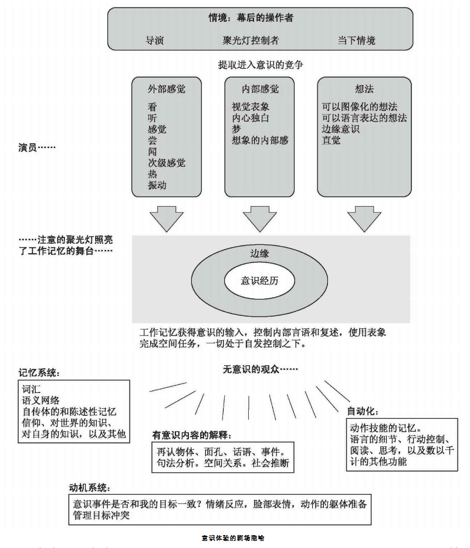

**意识**：对环境和认知事件的察觉。包括两个方面：

+ 对环境刺激的察觉：对世界的形象、声音...的察觉。
+ 对心理事件的察觉：对记忆、思想、情绪...的察觉。

## 意识的历史

19世纪科学心理学出现时，就开始对意识进行研究。后来，华生和斯金纳倡导的行为注意认为意识不可测量，放弃了对意识的研究。直到认知心理学出现后，很多心理学家有开始关注意识。但是，并没有找到很好的研究方法，泽曼曾经将意识分为四类：（1）我们觉察并相互作用的清醒状态；（2）我们对于周边每时每刻发生事物的经验；（3）我们的心理状态，包括信仰、希望、意图和愿望；（4）我们对自我的感知，包括自我认识，对自我的知识，对脑袋中思维、想法和感觉的拥有感。但是，这种分类对意识的研究并没有太大的帮助。

后来的心理学家开始将意识研究推入认知神经科学，通过脑定位技术来研究**意识的神经基础**。但是，这种研究也被很多心理学家认为是还原论，某个脑区与察觉体验有关并不意味着发现了意识所在。大多数心理学家认为，这种研究方法虽然不是最好的，但是也是进一步深入研究的很好的跳板。

> 还原论：一种哲学思想，认为复杂的系统、事物、现象可以将其化解为各部分之组合来加以理解和描述。

## 意识的框架：AWAREness理论

意识研究的主流框架是被称为AWAREness的意识综合框架，包含了意识研究的中心议题和最新观点。包含下面几个部分：

+ **注意**(Attention): 对外部和内部事物认知的聚焦。我们能引导自己的注意，并因此意识到外部和内部事件。注意可以被看做一个探照灯，将自己的光线聚焦到感兴趣的方向。
+ **觉醒**(Wakefulness): 从睡眠到清醒的连续频谱。意识是一种觉醒状态，这意味着意识具有唤醒的成分。意识具有不同的觉察水平和兴奋水平。通过冥想、药物或集中注意，我们也能改变自己的意识状态。
+ **构筑**(Architecture): 决定意识的生理结构的物理定位。
+ **对知识的回忆**(Recall of knowledge): 意识使人们能通过回忆访问个人信息和有关世界的知识，主要通过内部或外部提起的注意加工来完成。包括三个部分：
    + **自我知识**(self-knowledge)：是一种对个人信息的感觉。起码得知道你是你自己，这被称为**自我觉察**。自我觉察可通过能否认出镜子中的自己来测量，2岁以下的儿童、猫狗、鸟都没有自我察觉。自我知识除了包括自我察觉，还包括其他的关于自我的信息。
    + **世界知识**(world knowledge)：使我们能回忆起长时记忆中保存的许多事实。
    + **知识的激活**：一个人可以意识到另一个人的行动。共情敏感性有利于生存，并且对于理解我们现代人类如何看世界非常关键。
+ **感情**(Emotive): 有关意识的感情成分。感觉性是一种有意识的状态，并且通常被认为是对情绪的感受。情绪是有我们对外部事件作出反应而产生的内部状态所导致的，很难向别人描述。
+ **新异性**(novelty):  追求新异的、有创造力的、创新事物的倾向。新异性可来自环境的变化，预期的不一致，或者对于熟练的例行程序的违背。
+ **浮现**(emergence): 意识和其他神经过程不同，它处理的是私人的和内部的思想。意识是从大脑活动中浮现出来的。
+ **特异性**(selectivity)和**主观性**(subjectivity): 人类随时不断地选择一小部分想法进行考虑，并且会频繁受到新的想法或外部线索的干扰。意识很早就被认为用以关注特定事物从而阐明认识。探照灯是意识的特异性功能的具象表现，而有意识内容会在记忆的各个领域、知觉、意象、思想和行为间流动。主观性指的是每个人的意识体验是独一无二的。

AWAREness作为衡量意识的框架，每个维度都可以定量的评估打分，从而提供了一个心理测量的敏感度指标，可以比较不同生物或物体的意识水平。

## 意识的功能

一些哲学家认为，意识对人类的功能不一定是必要的，僵尸具有人类的功能，但是没有意识。它们具有识别红色的感受器，并且用这些信息来挑出熟苹果，但不会产生“红色”这样的主观体验。这一主观体验被称为**感受性**。感受性指的是感觉体验的性质，以及与之相关的体验和感受。人类体验客体的实质，并非我们用视网膜实际侦测到的电磁能，感受性被认为是现象学的，并且是主观的。

一些研究者认为意识存在的唯一理由是让个体凭意志采取的行动成为可能。凭个人意志采取的行动指的是那些通过选择采取的，而非本能或反射的行动。有了意识，凭个人意志采取行动将使我们得以凭自己的注意和行为使自己在环境中得到更好结果。

巴尔斯对意识的功能进行了分类，认为意识的功能包括：

+ **情景设定**（context-setting），系统借此通过情景和记忆中的知识来界定输入的刺激。
+ **适应和学习**（adaptation and learning），指的是成功处理新信息所需要的意识参与。
+ **优先次序区分**（prioritizing），即获得那些必须通过意识才能获取的广袤的无意识信息。
+ **召集和控制**（recruitment and control），意识在此影响运动系统来执行随意行动。
+ **决定**（decision-making）和执行功能，用于从无意识提取出的必要的信息和资源来帮助做出决定并进行控制。
+ **错误侦测与编辑**（error detection and editing），该功能专门用于深入无意识规则系统来让我们知道自己犯错了。
+ **自我监视**（self-monitoring），自我监控，以自我反省、内部语言和想象等形式帮助我们控制意识和无意识功能。
+ **组织和灵活性**（organization and flexibility），该功能使我们在可预测的环境中使用自动功能，但同时让我们在不可预测的环境中利用专门知识。

## 意识状态

意识和无意识之间最清晰的界限就在于人们的清醒状态和睡眠状态之间。用脑电仪(EEG)测量人睡眠时的脑电波，可以把从清醒到睡眠分为下列阶段：

+ 清醒状态：闭眼放松时，α波(8—12Hz)
+ 非快速动眼睡眠：唤醒水平逐渐降低。
    + 睡眠阶段I: 浅度睡眠，θ波(4—7Hz)
    + 睡眠阶段II: 睡眠纺锤，一组12—15Hz的有节奏的脉冲组成的脑电波。
    + 睡眠阶段III:  睡眠纺锤和一些δ波(1—4Hz)。
    + 睡眠阶段Ⅳ：深度睡眠，很难被唤醒，δ波数量增加。
+ 快速动眼睡眠(REM)：快速移动眼球和做梦，唤醒水平相当于阶段I。

睡眠会在非快速动眼睡眠和快速动眼睡眠间不断交替。

> 纺锤波由大脑的丘脑产生，而丘脑是负责将外部世界的信号传递给大脑其他部分的一种结构。研究人员认为，丘脑产生纺锤波正是为了阻止外部的噪音干扰睡眠中的大脑。

快速眼动睡眠时的大脑活动是由大脑诠释的，并且只可能是从你长时记忆中既有的知识框架提取出来的，还利用了故事或记叙文的形式呈现。

清明梦指做梦时你知道自己在做梦。清明梦者能随意地在梦中做决定。

药物起效的原因是我们大脑中有对药物的感受器。药物会通过神经递质来起作用，会改变我们意识的状态，与一般的工作状态大相径庭。药物可分为下面几种：

+ 镇静剂：降低神经系统兴奋性(酒精、巴比妥类药物、大麻)
+ 兴奋剂：提高神经系统兴奋性(尼古丁、可卡因、甲基苯丙胺类药物)
+ 迷幻剂：改变我们对现实的感觉(例如麦角酸二乙基酰胺/一种酸，裸头草碱/一种蘑菇)。迷幻剂会带来幻觉，你对自我、世界和感觉信息的觉察戏剧性地被迷幻药物改变了。

冥想也会影响大脑用于激活、理性决策和积极心境的左侧额叶皮层。

## 意识的模型

巴尔斯的**综合工作平台理论**将意识看作是一套在整个大脑里传播信息的全局广播系统的剧院。

舞台上有一个“聚光点”，随着注意的“探照灯”而可以移动。在聚光点周围是由那些重要，但含糊不清的意识事件构成的“边缘”。舞台就是工作记忆系统。剧院暗处的观众从聚光点处接收信息。幕后活动则塑造了聚光点处的事件。

意识体验的有限容量问题，比如我们已经知道的短时记忆所能保持的相对较低的项目数(7±2)。注意的选择性，当我们从信息中获取意义时，一次只能注意到它的一个重要侧面。我们具有的这种全局提取能力可最大限度地减少有限容量带来的“麻烦”。

## 自动加工

我们并不能意识到大脑中发生的所有加工。**自动加工**(automatic processes)是那些无法操纵的、无需意图或外部觉察的以及高效率的加工过程。

**内隐记忆**：在不需要意识或有意回忆的条件下，个体的过去经验对当前任务自动产生影响的现象。

**启动效应**：是指由于之前受某一刺激的影响而使得之后对同一刺激的知觉和加工变得容易的心理现象。研究者认为启动效应是内隐记忆的体现。

**阈下启动**：即在感觉阈限(即激活神经反应所需要的最低能量)之下呈现时发生的启动效应。

**元认知** 也是一种自动加工过程，是对自己认知能力的评估或了解。元认知涉及对记忆系统的提取和推断过程的监视和控制。

**监控**指的是我们如何评价我们所知道（或还不知道）的事情。

一个元认知的基础模型包括对元水平以及各个对象水平信息流的监控和控制。**元水平**是指我们对于记忆中有哪些、没有哪些的有意识觉察，而**对象水平**的则是指记忆中的具体内容。元水平实质上创立了对记忆中项目的记忆状态有一个综合认识的模型。基于元水平模型，个体能很快估计自己知道什么、不知道什么，从而决定是否需要努力试图回忆那些信息。

元认知系统包括两类监控：（1）预期式的，在获得信息之前或者期间发生；（2）回顾式的，在获得信息之后发生。元认知的具体监控包括：

+ 学习的容易程度：包括学习新知识的恰当策略选择，以及信息的哪部分最容易习得，预期式的。
+ 学习程度的判断：发生在记忆获得阶段或之后，预期式的。
+ 知道感：既可以是预期式的，又可以是回顾式的。
+ 自信判断：回顾式的，因为它们是在从记忆中提取项目后才进行的。
+ 元认知监控：指的是参与者判断自己的元认知状态。

**舌尖状态**：当人们在从记忆中提取项目发生困难时，然而他们又觉得只要再加把劲就能提取出来。是一种自然发生的元认知状态。

意识科学研究主要是集中在意识经验的神经学方面。通过研究在没有相应外部刺激变化的情况下大脑神经活动的变化情况，人们可以进一步了解意识的本质。

研究者发现通过刺激特定神经区域可以提取出久远的记忆。