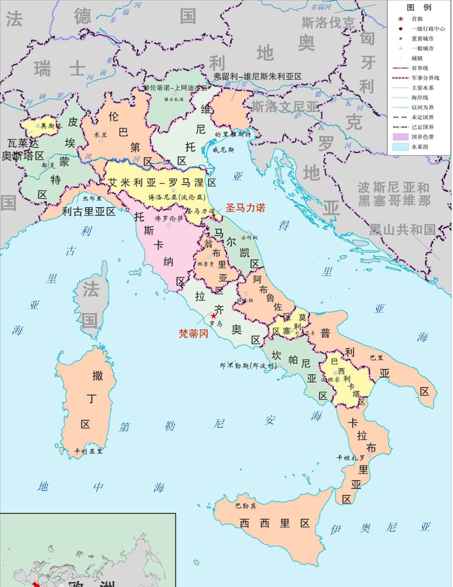
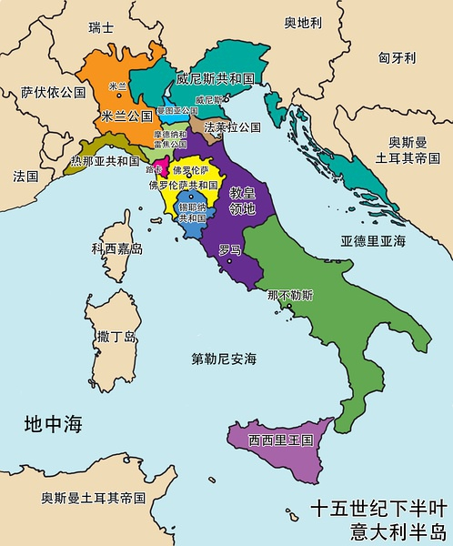

## 意大利

意大利

包含20个大区
+ 东北部
	+ 艾米利亚-罗马涅区：博洛尼亚
	+ 弗留利-威尼斯朱利亚区：的里雅斯特
	+ 威尼托区：威尼斯
	+ 特伦蒂诺-上阿迪杰区
+ 西北部
	+ 瓦莱达奥斯塔区：奥斯塔
	+ 皮埃蒙特区：都灵
	+ 利古里亚区：热那亚
	+ 伦巴第区：米兰
+ 中部
	+ 托斯卡纳区：佛罗伦萨
	+ 翁布里亚区：佩鲁贾
	+ 马尔凯区：安科纳
	+ 拉齐奥区：罗马
+ 南部
	+ 阿布鲁佐区：拉奎拉
	+ 莫利塞区：坎波巴索
	+ 普利亚区：巴里
	+ 坎帕尼亚区：那不勒斯
	+ 巴西里卡塔区：波坦察
	+ 卡拉布里亚区：卡坦扎罗
+ 岛屿
	+ 西西里区：巴勒莫
	+ 萨丁区：卡利亚里

## 历史

#### 大希腊时期(前800-前500年)

希腊人在亚平宁半岛南部建立了一系列殖民城邦。

#### 罗马时期(前500年-476年)

罗马共和国统一了亚平宁半岛，随后是罗马帝国时期。

#### 纷争时期(476年-18世纪)

西罗马帝国被日耳曼人推翻，意大利进入列强纷争时期。

先是伦巴第人进入意大利北部，建立伦巴第帝国。

然后是法兰克人帮助教皇打败伦巴第人，建立教皇国。

随后阿拉伯的倭马亚和阿拔斯帝国入侵意大利南部。

然后，南部出现了西西里和那不勒斯王国。

1796年，拿破仑入侵意大利，建立统一的意大利王国。拿破仑失败后，1815年，再次陷入分裂状态。

#### 统一

1860年，加里波第推翻波旁王朝统治。

1861年，意大利王国成立。1870年，意大利统一。

1946年，意大利成立共和国。

## 15世纪的意大利

主要国家
+ 米兰公国
	+ 1395年由祖安·加里西奥·维斯孔蒂建立，一直由维斯孔蒂家族统治。
	+ 1447，菲利普去世，没有男性继承人，米兰宣布称为共和国。
	+ 1450 年，菲利普的女婿弗朗切斯科迫使共和国最高会议拥立自己为米兰公爵。
	+ 1866年，并入意大利王国。
+ 威尼斯共和国：
	+ 成立于687年，为受伦巴第人侵扰的内陆居民迁移到此，建立共和国。隶属于东罗马帝国。
	+ 10世纪末，独立，称为富庶的商业国，在十字军东征时占领了东罗马帝国的大量领土，包括原希腊的大部分地区。
	+ 14世纪，和热那亚共和国4次海战，击败这一贸易对手，称为地中海区域强国，进入全盛时期。
	+ 15世纪末，新航路开辟，商业中心转移到大西洋沿岸，威尼斯开始衰落。
	+ 18世纪末期，被拿破仑消灭，随后划入奥地利。1866年，并入意大利王国。
+ 教宗国：也称教皇国
	+ 8世纪，教宗国成立。教宗统治的世俗领地。
	+ 800年，教皇将查理曼加冕为奥古斯都和罗马皇帝，使罗马教会摆脱了东罗马皇帝。教会加封的罗马皇帝不再干涉教会事务，而教宗却可以干涉世俗事务。
	+ 10世纪中期，日耳曼奥托一世征服意大利北部，教宗将其加冕为罗马人的皇帝。神圣罗马帝国诞生。奥托则承诺维护教宗国的独立。随后教宗和神圣罗马帝国之间一直有权力斗争。
	+ 14世纪初，成为完全独立的国家。文艺复兴时期，成为意大利最重要的政治力量之一。
	+ 18世纪法国大革命后，被法国占领，随后1815年，被重建。
	+ 1861年，被并入萨丁王国，即后来的意大利王国。
	+ 1870年，罗马也并入意大利王国，教宗国仅剩梵蒂冈城。
	+ 1929年，教宗国灭亡，由新成立的梵蒂冈国取代。
+ 佛罗伦萨公国：
	+ 1115年，成立佛罗伦萨共和国
	+ 1434年，美第奇家族建立僭主政治。随后，先后被法国和教宗国统治。
	+ 1512年，美第奇家族重新统治。
	+ 1569年，美第奇家族依靠西班牙支持，建立托斯卡纳大公国。
	+ 1860年，并入撒丁王国，随后称为意大利王国的一部分。
+ 那不勒斯王国：
	+ 12世纪，成为一个统一国家，但教皇不承认。
	+ 12世纪后，被安茹王朝统治。
	+ 1443年，被西班牙统治，使用两西西里王国的称号。
	+ 15世纪末，卷入意大利的战争，先后被法国和西班牙统治。
	+ 1799年，拿破仑占领后，成为帕特诺培共和国。
	+ 1815年，重新成立两西西里王国。
	+ 1861年，并入意大利王国。
+ 热那亚共和国
	+ 1100年，成立共和国。
	+ 11世纪末参加十字军东征，在巴勒斯坦建立殖民地。
	+ 13-14世纪末，进入鼎盛时期。帮助拜占庭复国，在黑海和地中海沿岸许多特权，贸易兴盛。
	+ 15世纪，在黑海沿岸的商业殖民地全部丧失。新航路开辟后，开始衰落。
	+ 1797年，拿破仑占领后，成立利古里亚共和国。
	+ 1805年并入法国。
	+ 1815年，并入撒丁王国，1860年，称为意大利王国的一部分。

当时主要的政治势力：
+ 国内：教宗国、威尼斯共和国、热那亚共和国、米兰公国、托斯卡纳大公国、那不勒斯王国。
+ 国外：西班牙、法国、瑞士、奥地利。

时代背景，资本主义萌芽，意大利文艺复兴。

本书作者马基雅维利(Niccolò Machiavelli，1469-1527年), 15世纪中期到16世纪初。

