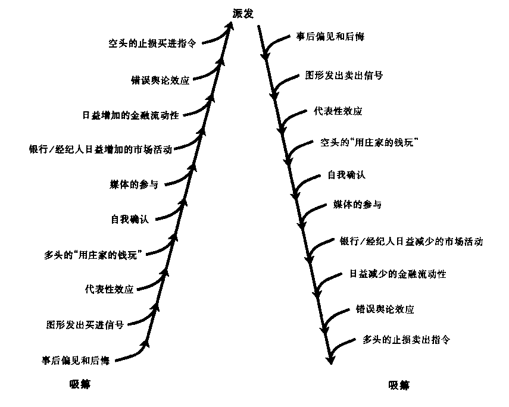

## 趋势反转时到底发生了什么

市场的内层核心是一些数量相对较少的职业投资者。他们会分析细微的变化，通过短期波动获利。

一些零星的冲突，只有圈内人士能察觉到变化并做出反应。而大多数参与者(长期投资者、共同基金、散户)都不会做出反应，他们只有在价格表现出长时间的显著变化后，才会受到影响并做出行动。

牛市后期，市场主力察觉到基本面无法支持价格，或者情绪指标发出警告后，会开始大肆清仓，市场剧烈波动。新手认为这是买入时机，而职业投资者却利用上涨的机会卖出离场。

趋势反转的特征是查尔斯.道称为**派发**或**吸筹**的过程。

与第6章讨论的趋势演进过程一样，人们通过各种新闻和报道认识道价格会上升，共同基金增加、泡沫、过度乐观、大家普遍认为上升趋势永不改变、市场上的新手越来越多。加速、无规律的波动和异常大的成交量，此时市场大鳄已经清空离场。

时间也是非常重要的因素，可能导致交易不活跃的市场再次活跃，趋势反转。

## 主要趋势反转时的预警信号

市场反转的重要信号是货币政策变化和价格处在极端水平。本书只讨论心理指标。

主要趋势反转时有六条特征

+ **加速和放量**：新买家指数级增长、衰竭性缺口，大量派发，新进入者接盘。对应心理学解释为认知失调、同化错误、选择性暴露、选择性理解、自负行为。
+ **趋势破坏**：顶部或底部的形态、阶梯型的趋势被破坏，持续一段时间，使交易者心理受到伤害。对应心理学解释为后悔理论、事后偏见。
+ **剧烈变化**：一段时间会出现与趋势相反的大幅变化，令人恐惧。但是没有重复，缺乏时间因素。对应心理学解释为认知失调。
+ **时间和动量**：趋势趋于静止，长时间没变化，投资者缺乏耐心而脱手。表现为动量指标下降。对应心理学解释为知识态度。
+ **缺乏广度**：较小的股票不再跟随大盘，腾落线、净新高数等广度指标下降。投资者转向流动性好的股票，随时准备脱手。对应心理学解释为知识态度。
+ **形成特殊图形**：楔形、双重/三重头或底、头肩形、关键反转等。趋势被影响深远的理由打破，派发和吸筹在进行，人们预期到反转。对应的心理学解释为知识态度、自我防御态度。

反转趋势中三种主要的技术图形为

+ **双重/三重头和底**：主力因为不能突破之前的高点而放弃某个趋势。注意这两种图形和矩形、旗形的区别。这种图形并不经常发生，而且第二次和第三次的突破努力要低于第一次。成交量和动量都小很多。而且，必须跌破两个头部之间的底部。
+ **头肩形**：达到新高后，价格下降，在前一个头部没有支撑而是回落到底部附近，第三个头成交量大幅萎缩，跌破前两个底部。
+ **关键反转和岛形反转**：经过长时间僵持后的突然反转。岛形反转前后都有缺口。两个反转都是次要趋势反转，非主要趋势反转。

