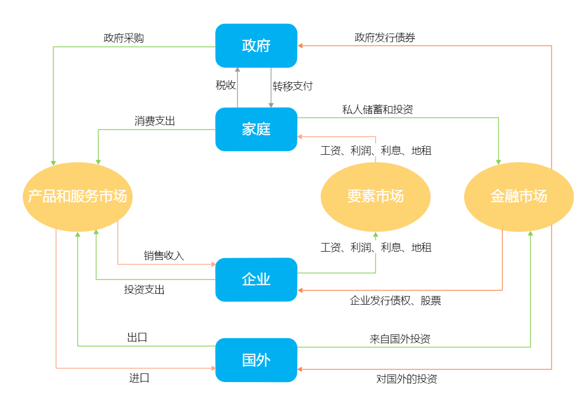

## 国民收入账户

**国民收入与产出账户**：简称国民收入账户，用于记录经济体不同部门之间的**货币流量**。包括消费者支出、企业投资支出、生产着的销售、政府购买等。

循环流向图

+ 四个部门：政府、企业、个人、国外
+ 三个市场、产品和服务市场、要素市场、金融市场

对于每个部门和市场，**流出的货币量的总和等于流入的货币量的总和**。这是一个会计恒等式。

根据上面的循环流向图，一个经济体生产的产品和服务的总价值：

+ 从资金流入的角度：即在产品和服务市场的所有消费，$$ 政府采购 + 个人消费支出 + 企业投资支出 + 出口 - 进口$$
+ 从资金流出角度：即为企业的销售收入(根据会计恒等式，上面的公式与此相等)

最终产品和中间产品

+ 最终产品和服务：销售给最终或终端使用者的产品和服务。
+ 中间产品和服务：一家企业从另一家企业购买的用于生产最终产品和服务的投入品。

**国内生产总值(gross domestic product, GDP)**:  一个经济体在一段时期内所生产的最终产品和服务的全部价值。

计算GDP的三种方法

+ 产出法：加总生产的最终产品和服务(即企业的销售收入)
+ 支出法：加总对国内生产的产品和服务的总支出($政府采购 + 个人消费支出 + 企业投资支出 + 出口 - 进口$ )
+ 收入法：经济体中的总收入。即家户获得的所有收入。(从企业到家户的要素流入量价值必等于企业的销售收入，即GDP)

> 此处的企业可以看成一个纯粹的生产单位，不保留任何利润，所有的利润都通过要素收益的方式支付给了家户。
>
> 企业是唯一的生产单位，企业的销售收入即为生产的所有产品的和服务的价值。
>
> 家户是唯一的收入单位，所有的收入都流入了家户。

产出法：计算中间产品的话会导致重复计算，因此，只计算每个生产商的增加值，即其销售收入减去它所购买的中间产品和服务的价值。

支出法：为了避免重复计算，只计算对最终产品和服务的支出。(原材料不被计入最终支出，但是购买机器设备等资本品会被计入最终支出)。公式
$$
GDP = C + I + G + X - IM
$$

+ C 为消费
+ I 为投资
+ G 为政府购买
+ X 为出口
+ IM 为进口

收入法：企业的销售收入必定会流向某个地方。

GDP包含和不包含的项目

+ 包含：国内生产的最终产品和服务，包括资本品、新建筑以及存货变动。(美国的GDP还包含自助房屋的价值估算)
+ 不包含：
    + 中间产品和服务
    + 投入品
    + 二手商品
    + 股票和债券等金融资产
    + 国外生产的产品

### GDP和GNP

GNP是国民生产总值，为一个国家家户所赚取的全部要素收入。会剔除外国人在本国赚取的要素收入。对于大国GDP和GNP相差不大，对于小国相差很大。

使用GDP而不是GNP的原因

+ GDP更适合衡量生产的短期波动
+ 要素收入的国际流动数据可靠性差

GDP主要用来度量经济规模，可以对比不同国家不同年份的经济状况。

GDP跨期比较时，有一部分增加额是由于产品和服务的价格增长而不是产量增加，因此，要衡量产出的真实变化，就要进行价格因素的调整，即实际GDP。

## 实际GDP

 GDP的上涨可能是因为产出增加，也可能因为通货膨胀。更好的衡量产出的方法，是实际GDP。

**实际GDP**(real GDP)：一个经济体一年内生产的以某个特定基年价格计算的最终产品和服务的总产值。

**名义GDP(nominal GDP)**：一个经济体一年内生产的以当年价格计算的最终产品和服务的总产值。

基年的选择可能对GDP的增长率的计量有一定影响。

实际上美国实际GDP的统计使用链式美元表示。

链式美元：在计算实际GDP的变化时，将较早和较晚的基年的GDP增长率进行平均后的数值。

 

人均GDP：用GDP除以人口规模。

人均GDP不足以衡量一个国家的民众福利水平，仅在比较国家的劳动生产率时可以作为一个衡量指标。**人均GDP不是一个合适的政策目标**。

## 价格指数与总体价格水平

**总体价格水平(aggregate price level)**：度量经济体中价格水平的指标。

**市场篮子**：消费者购买的产品和服务的一种假想组合。

**价格指数**：衡量某一年中一个给定的市场篮子的购买价格。(一般是相对于基年市场篮子价格的比率)
$$
价格指数 = \frac{某一年的市场篮子价格}{基年的市场篮子价格} \times 100
$$
**通货膨胀率(inflation rate)**
$$
通货膨胀率 = \frac {第2年的价格指数 - 第1年的价格指数} {第一年的价格指数} \times 100
$$
最重要的价格指数为 **消费者价格指数(cousumer price index, CPI)**：度量一个典型的家庭的市场篮子的价格指数。

其他价格指数包括：

+ **生产者价格指数(producer price index, PPI)**：生产者购买一市场篮子原料和服务的价格指数。由于大宗商品能够迅速进行价格调整，**PPI对通货膨胀和通货紧缩压力的反应比CPI更敏感，是通货膨胀的先行预警信号**。
+ **GDP缩减指数(GDP deflator)**：也称GDP平减指数，是当年名义GDP与实际GDP的比值。
$$
GDP缩减指数 = \frac{名义GDP} {实际GDP} \times 100
$$

三种价格指数得出的通货膨胀率的变化通常是一致的。

CPI对生产生活的影响最直接，也是政治上最敏感的指标。

