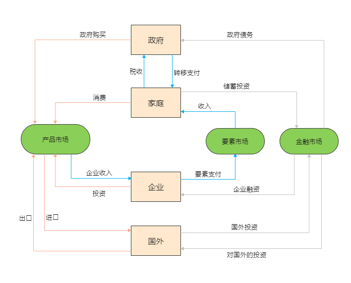

货币在经济中的循环流程图

用一个古典模型来解释这张图。

## 产出的决定

可以假定企业为唯一的生产单位，则企业的产量之和就是经济体的产出。

企业产量的决定因素

+ 投入的生产要素的数量，主要包括劳动和资本两种生产要素。
    - 资本是工人使用的工具。
    - 劳动是工人的工作时间。
+ 把投入转化为产出的能力，即技术和管理水平。

用生产函数来说明投入产出关系：
$$
Y = F(K, L)
$$
Y 为产出，K 为资本，L 为劳动

假设生产函数具有**规模报酬不变**的性质，即生产要素增加相同的百分比会导致产出增加相同的百分比。

可以得到产出的供给量，假设资本和劳动都是固定的，则产出也是固定的。
$$
\begin{gather*}

K = \overline{K} \\
L = \overline{L}  \\
\\
Y = F(K, L) = F(\overline{K}, \overline{L}) = \overline{Y}
\end{gather*}
$$
在资本、劳务和技术都不变的情况下，产出是固定的。

## 收入分配

**新古典分配理论**：国民收入在要素之间的分配基于要素市场上供给和需求的平衡。

考虑单个企业的情况，基本假设

+ 经济中的生产要素是固定的，要素的供给曲线是一条垂线。
+ 企业的产品市场和要素市场都是完全竞争市场，是价格接受者。企业无法决定产品和要素的价格，只能接受。
+ 假设企业雇佣工人，并以租赁价格租赁资本。

企业的目标是利润最大化
$$
利润 = P \times Y - W \times L - R \times K
$$

+ P 为产品价格，W 为工资水平，R 为资本租赁价格，因为处于完全竞争市场，这些价格都是固定的。
+ Y 为产出、L 为劳动量、K 为资本量，在价格水平固定的情况下，利润就取决于L和K，即要决定劳动和资本的使用量，使利润最大化。

### 劳动

**劳动的边际产量**(mariginal product of labor, MPL)：资本量不变的前提下，多雇佣一单位劳动得到的额外产量。
$$
MPL = F(K, L+1) - F(K, L)
$$
假设劳动的边际产量递减。

企业在考虑雇佣的劳动数量时，会计算增加一单位的劳动带来的收益是否能抵消成本，即
$$
P \times MPL - W > 0
$$
企业会一直雇佣员工，直到不再有利可图时
$$
P \times MPL = W
$$
可以写为
$$
MPL = \frac {W} {P}
$$
$\frac{W}{P}$ 为实际工资率。

MPL曲线向下倾斜，MPL曲线也就是企业的劳动需求曲线。

### 资本

**资本的边际产量**(mariginal product of capital, MPK), 劳动不变的情况下，企业从额外的一单位资本中得到的额外产出。
$$
MPK = F(K+1, L) - F(K, L)
$$
和劳动一样，资本的边际产量递减。企业会租借资本，直到额外的收益等于资本成本时，即
$$
P \times MPK = R 
$$
可以得到
$$
MPK = \frac {R} {P}
$$
为资本的实际租赁价格。

带入利润公式
$$
利润 = P \times Y - W \times L - R \times K
$$
得到企业的实际利润
$$
经济利润 = Y - MPL \times L - MPK \times K
$$
完全竞争市场中，企业的利润为0，则
$$
Y = F(K, L) = MPL \times L + MPK \times K
$$

> 注意，经济利润是扣除所有要素收入后的利润，与现实中的会计利润不一样。现实中的会计利润相当于资本回报。

从上面的公式可以看出，**要素的收入分配取决于要素的边际产量(要素价格)和实际的供给量。任何要素数量的变化都会改变要素价格，从而改变收入分配。**

**柯布-道格拉斯生产函数**：生产函数的一种可能的形式。用来解释美国为何工人的收入和资本收入总是同比增长。
$$
F(K, L) = A \times K^\alpha \times L^{1-\alpha}
$$

+ A是一个大于0的常数，用来衡量技术生产率。
+ $\alpha$​ 衡量收入中资本的份额，即收入中多大份额分给资本。

这个生产函数具有规模报酬率不变的性质。

同时，对生产函数求导，可得
$$
\begin{gather*}
MPL = (1-\alpha) \times A \times K^\alpha \times \ L^{-\alpha}  \\
MPK = \alpha \times A \times K^{\alpha -1} \times \ L^{1 -\alpha} 
\end{gather*}
$$
劳动的增加，降低了MPL，提高了MPK。资本的增加，降低了MPK，提高了MPL。

上面的公式也可简化为
$$
\begin{gather*}
MPL = (1-\alpha)\times \frac{Y} {L} \\
MPK = \alpha \times \frac {Y} {K}
\end{gather*}
$$

$\frac{Y}{L}$ 为平均劳动生产率，$\frac{Y}{K}$ 为平均资本生产率。要素的边际生产率与平均生产率成正比。

要素的收入分配取决于$\alpha$ ，而不是要素的数量。

## 需求

需求就等于经济体的总支出。
$$
Y = C + I + G + NX
$$

### 消费

家庭的消费与可支配收入正相关。

**可支配收入**为支付了所有税收后的收入
$$
Y - T
$$
消费函数
$$
C = C(Y-T)
$$
**边际消费倾向**(marginal propensity to consume, MPC) 是可支配收入增加一个单位时消费的变化量。

### 投资

投资品的需求量与**利率**(interest rate)负相关。如果利率上升，有利可图的项目会较少，投资的需求减少。

利率可以分为名义利率和实际利率。名义利率是通常所说的利率，实际利率是对通货膨胀进行校正后的名义利率。
$$
I = I(r)
$$

### 政府购买

政府的收入主要是税收，支出包括政府购买和转移支付。

政府购买等于税收减去转移支付，这里不考虑转移支付。

政府购买等于税收时，为平衡预算。支出大于收入时，为预算赤字；否则为预算收入。

在这里，我们认为政府购买和税收都是外生变量，是固定的。
$$
\begin{gather*}
G = \overline{G} \\
T = \overline{T}
\end{gather*}
$$

## 产品与服务市场的均衡

结合产品和服务的供给和需求，可以得到

供给
$$
Y = F(\overline{K}, \overline{L}) = \overline{Y}
$$
需求
$$
Y = C + I + G = C(\overline{Y} - \overline{T}) + I(r) + \overline{G}
$$
供给等于需求时
$$
\overline{Y} = C(\overline{Y} - \overline{T}) + I(r) + \overline{G}
$$
r是唯一未确定的变量，它必须进行调整，确保供给等于需求。

r的确定要考虑金融市场。利率是金融市场上借款和贷款的价格。

国民收入核算恒等式改写后得到：
$$
Y - C -G = I
$$
其中$Y-C-G$  可以理解为满足了消费和政府购买后的剩余产出，称为**国民储蓄**，记为S。
$$
S = (Y - T - C) + (T - G) = I
$$
其中$Y - T -C$ 为可支配收入减去消费，为**私人储蓄**。$T-G$ 为税收减去政府购买，为**公共储蓄**。
$$
S = \overline{Y} - C(\overline{Y} - \overline{T}) - \overline {G} = \overline {S}
$$
S是固定的，所以
$$
\overline {S} = I(r)
$$
这就是可贷资金市场的供给和需求曲线。

供给曲线是垂直的，需求曲线向下倾斜，二者的交点就是均衡利率点，也是使产品市场上供给等于需求的点。

影响供给曲线的因素

+ 政府购买：根据公式，政府购买的增加，导致储蓄减少。供给曲线左移，从而导致均衡利率上升，投资减少。这就是政府购买的挤出效应。
+ 税收减少：税收减少，可支配收入增加，消费增加，储蓄减少。供给曲线左移。

影响需求曲线的因素

+ 技术进步：技术进步，可投资机会增加，需求曲线右移，实际利率上升，但是总的投资量不变(因为储蓄为垂线)。
+ 政府政策扶持：投资机会增加，需求曲线右移。

如果假设资金的供给曲线也随利率变化，是一个向上倾斜的曲线，则需求曲线的右移会导致实际的投资量增加。

这是一个很简单的有各种假设的古典模型，后面会不断的放松各种假设。

> 经济学的数学模型够不构严密，很多时候都是一个公式变来变去，类似$Y = C(Y-T) + I(r) + G$ , 左右的Y是不是一个Y无法确定，而且没有把Y单独提出来，就像$y = 3\times y + 5 \times x$ 这样，很难进行进一步的推论。

