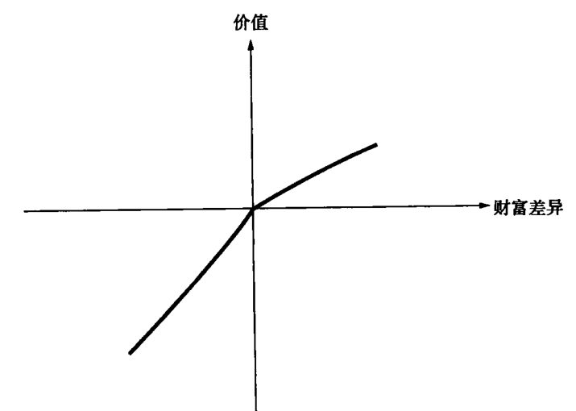

### 前景理论

两类不同的理论
+ **规范性理论**：理性人假设。如期望效用理论
+ **实证性理论**：关注人的真实行为，基于实际观察建立模型。如前景理论。

#### 决策行为的三个要素
期望效用理论无法充分解释实际情况下人的决策行为，人们的行为常常与期望效用理论相悖。

期望效用理论的观点：
+ 人们的效用与绝对的财富水平相关
+ 人们对风险的态度时一致的。

前景理论的观点
+ 人们更关注财富的变化，即实际的收益和损失，而非财富水平。
+ 人们根据前景的性质，改变对风险的态度。人们倾向于在收益域内规避风险，在损失域内寻求风险。

**参照点**(reference point) 人们通常会根据参照点来进行判断。

据财富是增长了还是损失了，来判断赌局结果的优劣，参照点通常为当前的财富水平。

人们根据财富相对于参照点的增减，来判断前景的优劣，该参照点一般为当前财富水平。

**损失规避**：对于大多数人来说，损失带来的心理影响大于收益。

决策行为的三个要素：
+ 人们根据前景的性质，改变对风险的态度。人们倾向于在收益域内规避风险，在损失域内寻求风险。
+ 人们根据财富相对于参照点的增减，来判断前景的优劣，该参照点一般为当前财富水平。
+ 人们之所以规避损失，因为损对人造成的心理影响大于收益。

#### 价值函数

价值函数中使用**决策权重**，而不是概率，决策权重是概率的函数。前景$P(\rho_1,\rho_2,..., \rho_n, w_1, w_2,...,w_n)$

$$
V(P) = \sum_{i=1}^n \pi(\rho_i) \times v(z_i)
$$
其中$\pi(\rho_i)$ 为决策权重，$v(z_i)$ 为财富的变化值。

价值函数的特点：
+ 纵轴为价值，横轴为财富变化。
+ 在收益域内是凹函数，损失域内是凸函数。
+ 损失域内的斜率大于收益域内的斜率

#### 彩票与保险

效用理论无法解释人们同时购买彩票和保险的问题，因为人们购买彩票是寻求风险，而购买保险是规避风险。

前景理论的解释：人们会高估小概率事件的权重，人们按照决策权重$\pi(\rho_i)$ 而不是概率$\rho_i$ 来计算前景的价值。

风险概率的四重性
+ 面对大概率的收益时，表现为规避风险
+ 面对大概率的损失时，表现为寻求风险
+ 面对小概率的收益时，表现为寻求风险
+ 面对小概率的损失时，表现为规避风险

#### 加权函数

确定$\pi(\rho_i)$

任何风险决策的理论都要反应这种风险概率的四重性。

决策权重函数要反应这种四重性

1979年，卡尼曼和特沃斯基提出了决策权重函数要满足的条件，但并未给出具体的函数定义。
+ 确定性效应：比起大概率发生的结果，人们更重视确定性的结果。
+ 人们给予小概率的结果更大的权重，小概率的权重被高估。

1992年，累积前景理论，给出了决策权重函数的表达式。

#### 价值函数

卡尼曼和特沃斯基给出了价值函数和权重函数的表达式

价值函数
$$
v(z) = \begin{cases}
	z^\alpha, 0 < \alpha < 1, z \ge 0 \\
	-\lambda \times (-z^\beta), \lambda > 1 , 0 < \beta < 1, z < 0
\end{cases}
$$
z是财富的增加值，参数估值
+ $\alpha = 0.88$
+ $\beta = 0.88$
+ $\lambda = 2.25$
在收益域内是凹函数，在损失域内是凸函数，反映出决策者对损失的厌恶。

决策权重函数
$$
\pi(\rho) = \begin{cases}
\frac{\rho^\gamma}{(\rho^\gamma + (1 - \rho)^\gamma)^{\frac{1}{\gamma}}}, \gamma > 0, z \ge 0 \\
\frac{\rho^\chi}{(\rho^\chi + (1 - \rho)^\chi)^{\frac{1}{\chi}}}, \chi > 0, z < 0
\end{cases}
$$
参数估计
+ $\gamma=0.61$
+ $\chi=0.69$

#### 其他

**禀赋效应**，也称为**现状偏差**，一旦人们拥有一件商品，其价值就会增加，放弃该商品就要得到更大的价值。用前景理论解释，是因为损失造成的心理影响要大于收益。

通过对黑猩猩的研究，发现它们选择食物的行为也表现出了明显的禀赋效应。因此，可以推断禀赋效应是在进化中形成的。对于一个可以勉强温饱的原始人，多获得50%的食物对他而言是好事，但是如果损失50%的食物，则可能是灭顶之灾，因此，损失带来的痛苦大于收益带来的快乐。

除了前景理论，还存在很多其他的期望效用理论的替代理论。

### 框架

**决策框架**：决策者对于问题和可能结果的看法。表现形式、决策人对问题的看法、决策人的个性都可能对框架造成影响。

决策会因为框架的变化而变化，这违背了期望效用理论。

实验表明，对于同一个问题以不同的形式提出，人们的决策也不同。

**一体化**和**分离化**
+ 一体化：所有的情形被整体的一同看待。
+  分离化：各种情形被逐一的分开看待。

卡尼曼和特沃斯基的研究发现，人们有时会采用一体化的思维框架。这与标准前景理论的分离化假设不同。

一体化产生的效应

**盈亏平衡效应**：人们为了盈亏平衡，会愿意承担更高的风险。人们做出新的决策时，会考虑之前的收益或损失。

**赌场盈利效应**：人们获得收益后，会愿意承担更高的风险。

### 心理账户

**心理账户**：一种用于管理决策行为的方法。是个人或家庭用来管理、评估、跟踪金融活动的一组认知活动。主要组成部分由账户分配、销户和评估。

心理账户是一种心理层面的东西，并不真实存在。心理账户的资金分类方法导致经济学家假设的资金可以替代不成立，人们不会将一个账户的资金用于另一个账户。

心理账户的销户时间很重要。对于一笔即时消费，消费完成之后就会销户。

对于一项投资，如果出现了损失，人们倾向于避免销户。这种避免卖出亏损股票的现象称为**处置效应**。

处置效应，盈亏平衡效应、赌场盈利效应都说明决策中存在**路径依赖性**，即在做出决策时，更关注如何达到现状，而不是仅仅关心现状。

如果存在路径依赖性，就需要很强的自制力，才能专注的向前看，而不是为了过去的事情而焦虑或沾沾自喜。

如果投资者采取分离化的思维框架，就不会出现处置效应。

### 从理论到实践

一些经济学家对前景理论提出了质疑，他们认为前景理论的研究材料都是基于学生的问卷调查，一方面学生无法代表所有的投资者；另一方面，问卷调查与实际的投资决策也有很大的不同。

实证研究中发现，很多结果验证了前景理论，也有很多结果和前景理论相悖。

前景理论是一个个体行为模型，无法证明个体的加总就会影响群体决策，即市场行为。

弗农.史密斯：“绝大多数学科中，在理论完备形成之前，都是先出现大量的观察结果，激发我们去探究这规律背后的原因。”

