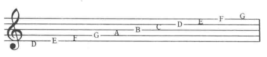
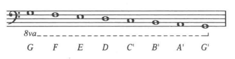

## 五线谱上的音符

我们通常所见的音乐记谱法，是用记录音高的符号，即音符(note)，写在五条线和四个间组成的五线谱(staff)上。音符在五线谱的位置上表现了音的高低。

## 谱号

音符的实际音高由五线谱最左的谱号(clef)决定，谱号记在五线谱的某一条线上，这条线指明了确切音高。

不同的谱号记录不同的音高范围

高音谱号(treble celf), 记在五线谱的第二线上，表示钢琴键盘中部以上的G音。高音谱号衍生自古代字母的G的装饰体写法。圆形圈起第二线。

低音谱号(bass clef)标记了钢琴键盘中部以下F音的位置，形状也是古代字母F的装饰体。

还有C谱号，标记了中央C的位置，一般在器乐演奏中出现，本书不使用。

## 音符的名字

确定了谱号，就可以确定其他线和间上的音高，每个音高用一个字母表示。按照字母表顺序。

用字母表的前7个字母A、B、C、D、E、F、G来标记音符，序列重复循环。

低音谱表的对应音符

高音谱表的对应音符

钢琴上从左到右的相同字母的音，后一个音的振动频率时前一个音的两倍。

五线谱每一条线和间都对应钢琴键上的一个白键。

为了标记超过五线谱范围的音，会在上方或下方加一些小短线来表示更高或更低的音，称为加线(ledger lines)。

## 八度内的音程

任意两个音的距离叫做**音程**(interval)。

如果一个音程的两个音同时弹奏，这个音程叫做**和声音程**(harmonic interval)。

两个音先后弹奏叫做**旋律音程**(meldoic interval)。

两个相邻的、由相同的字母组成的音程叫做**八度**(octave).

两行五线谱组成的**大谱表**(grand staff), 中央C在高音谱表的下加一线，在低音谱表的上加一线。

## 音域分组命名系统

音名系统可以帮助我们在没有五线谱的情况下方便的描述某个特定的音。

从中央C开始向上(中央C就是c')，分别是
+ 小字一组，用`c'、d'、e' ...` 表示
+ 小字二组，用`c''、d''、e'' ...` 表示
+ 小字三组，用`c'''、d'''、e''' ...` 表示
+ ...

从中央C往下，分别为
+ 小字组，用`c、d、e ...` 表示
+ 大字组，用`C、D、E ...` 表示
+ 大字一组，用`C'、D'、E' ...` 表示
+ ...

有时也用(c1, c2)这种方式表示。

这个系统用来描述某个特定的音。

如果只是泛音，并不强调在哪个八度，就用大写的字母表示。

八度有时也用 8va表示。当音符上出现(8va---)时，虚线里的音符要高八度演奏。

当音符下出现(8va---)时，虚线里的音符要低八度演奏。

示例：如下的乐谱

实际上是

如下的乐谱

实际上是

## 吉他记谱法

写给有品乐器的音乐，如吉他或贝斯，会有三种记谱法：
+ 五线谱
+ 和弦标记
+ 指法谱

在很多爵士乐和流行音乐中，三种谱法都会使用。

用五线谱记录吉他谱时，记谱的音会比实际高一个八度，这种记谱法称为**移调记谱**(transposition), 贝斯也这样记谱。

**和弦记谱**：一种和声速记的简单形式，包括三项信息
+ 和弦总标记，大写字母，并标记和弦的根音。
+ 标记三和弦(triad)的性质
+ 附加色彩音(color tone)

和弦记谱法不会给出音符，也不会给出需要重复的音以及弹奏的模式和节奏。

**指法谱**(tablature)：每个独立音都会在表示指法的表格里用一个小圆点标记。