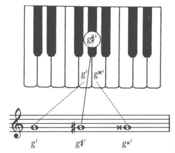

## 八度、半音和全音

两个同名音符之间的音程称为八度。八度表示较大的音域范围。

大多数音乐中，最小的音程距离为钢琴上两个相邻键的距离，称为**小二度**(half step) 或者 **半音**(semitone)。

比半音还小的音程称为滑音或**滑奏**(glissando)。

在钢琴上，任何一个从C到C的八度中， 有两组半音是由相邻的白键组成的，E和F，B和C，其他的白键都是由黑键隔开，中间的距离有两个半音，称为**全音**(whole step)。

一个音进行到它相邻的音(半音或全音)的运动叫级进(stepwise motion)

## 升号、降号和还原号

为了记录钢琴上的黑键，要用变音记号来表示升高或降低的七个基本音(A、B、C、D、E、F、G)

升号(♯， sharp)： 表示升高半音。

降号(♭, flat): 表示降低半音。

还原记号(♯, natural)：表示将之前升高或降低的音还原。

重降记号(♭♭, double flat)：降低2个半音。

重升记号(x, double sharp)：表示升高2个半音。

如果要取消部分升降，应该先还原再标记。

## 等音记法

根据不同的记谱方式，键盘上相同的音会有不同的名字。音高相同而记法不同的音叫做**等音**(enharmonic)

## 音阶

一个八度内按顺序排列的音符叫音阶(scale)，音阶本身归纳了正常音乐语境中所需要的所有的音。

## 半音阶

当八度内所有的12个音按照顺序排列好，就形成了**半音阶**(chromatic scale)。

升号用于上行音阶

降号用于下行音阶

**注意 E和F，B和C两对半音不需要变音符号**

