## 节奏是什么

音乐是根据时间组织起来的一种声音艺术。节奏(rhythm)是一种力量，能产生、控制和组织音的运动与时间的关系。

节奏不仅出现在音乐里，我们也可以理解它是一种带来生命的力量，这种力量也存在于我们自己的体内，如心跳、呼吸、走路、睡觉和醒来的规律性。

日夜更替、季节变化、出生死亡都是一种节奏组织。

## 节拍

划分音乐时长的有规律的律动叫做 **节拍** (beat)。它可以看做包括**重音**(accent)或强拍的时间片段，重音时每个片段里最主要的节拍， 我们叫强拍1，片段里其他的节拍从强拍开始往后数。

在音乐记谱中，用重音符号(>)来标记抢拍音符上。

注意，这些自然的强拍非常微妙，如果过于强调它们，反而影响音乐的表达。

## 拍子

最简单的节拍包含二或三个拍子，大的分组是小的分组的组合。

当一组有规律重音的节拍出现在音乐中时，我们称它为**拍子**(meter).

一组里有两个律动，称为**二拍子**(duple meter)

一组里有三个律动，称为**三拍子**(triple meter)

带有规律重音的每一组节拍叫做小节(measure或bar)

每个小节有个穿过五线谱的垂线称为**小节线**(bar line)

不是所有的音乐都按照**拍子度量**(metric)， 一些古老的天主教音乐和现代的电子乐有采用**非拍子度量**(nonmetric)的方式。

## 音符和它们的时值

一个音符由1-3个组成部分来表示其时值。包括
+ 符头(notehead)
+ 符尾(stem)
+ 符干(flag)

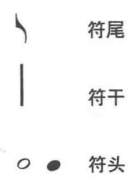

除了全音符，都有符干。

全音符和二分音符的符头是空心的，其他都是黑色的。

八分音符和更小的都有符尾。符干上每多一条符尾，音符时间就减少一半。

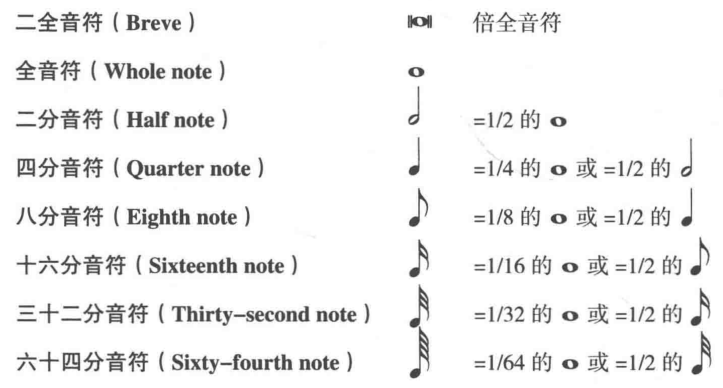

## 用休止符和延音线来增加音符的时值

到目前为止，所有的音符时值都是1:2的关系。如果想表示其他比例时值的音符，可以通过两种方式。

**附点**(dot)：在符头的右边加小圆点，增长原有时值的二分之一。

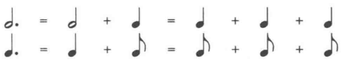

如果五线谱在间上，附点写在间上。如果音符在线上，附点写在线上的间上。

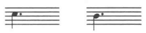

**延音线**(tie)：一条连接相同音高的两个音符的符头的弧线。用来表示两个音符的时值要加在一起。使用延音线，可以表示任意时值的音符。

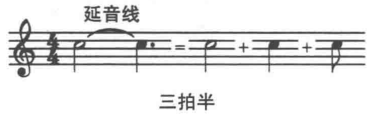

## 休止符

休止也是音乐的一种表达方式，**休止符**(rest)显示了休止的长度。休止符的时间长度和同名的音符的时值一样。

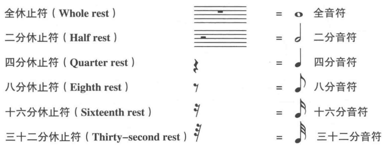

休止符也可以使用附点。

休止符不能使用延音线，因为没有必要。一系列连续的休止即可。

## 单位拍和拍号

任何其他音符时值都会与上述表格中的单位拍形成比例关系，最普遍的**单位拍**(beat units)是四分音符和八分音符。

每个乐曲开头，谱号的右边两个数字，下面的数字就是单位拍。上面的数字是每个小节多少个单位拍，这两个数字称为**拍号**(time signature)。

单位拍的基本组合和每个小节的节拍数叫拍子。

与谱号不同，拍号不需要重复，除非需要换拍子。

有时候用C符号来表示4/4拍

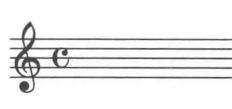

## 单拍子

当单位拍被分成两份，称为**单拍子**(simple meter)。

`Op.` 是opus的缩写，在意大利语中是作品的意思，经常出现在曲子的标题后，表示一个音乐作品或一组作品。也表示出版的顺序，后面有数字。

## 起拍

如果第一条小节线前面出现了节拍或部分节拍，这种情况称为**起拍**(upbeat, anacrusis或pickup)。

## 复拍子

某些拍子中，单位拍能分成三份，这种情况下单位拍通常是一个附点音符，这种情况下，拍号下面的数字表示分派的音符时值，而不是单位拍的。这种拍子叫**复拍子(compound meter)**。

这种情况下，拍号上的数字都是3的倍数，6,9，或12。

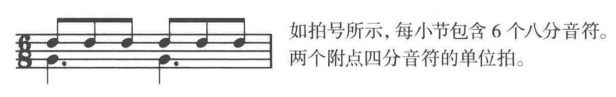

## 三连音

有时，我们会把一个通常分为两份的音符分成三等份，这三个音符写成一组，上面标注3，称为**三连音**(triplet)。

三连音中，数字3卸载重点上方符干的末尾，如果三连音没用符杠连起来，那么就要用括号括起来。

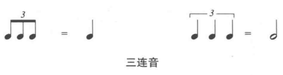

同样的原理可以写五连音或七连音。

## 用符杠分组

把一些带符尾的音符放在一起，符尾会被一条粗线取代，这条粗线就是**符杠**(beam)会把音符连接起来。

如果音符有多条符尾，则符杠数量增加。

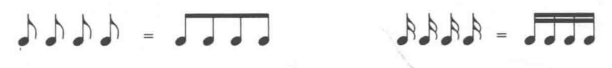

不同时值的音符组合

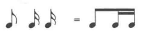

在音乐结构中，可以用符杠根据节拍把音符分组。

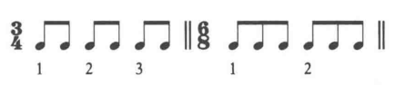

## 更多有关拍子的知识

拍子是按照每小节的节拍数量分类的，最常用的有二拍子，三拍子和**四拍子**(quarduple, 每小节四拍，2个二拍子)。

还有**五拍子**和**七拍子**，实际上是把二拍子和三拍子组合在一起。

一些音乐中会频繁的改变拍子，称为**变拍子**(changing meters)。

## 速度

节拍运动可快可慢，**速度**(tempo)来表示节拍的快慢。

常见术语
+ **行板**(andante)：慢，走路一样的速度。
+ **中板**(moderato)：中速。
+ **快板**(allegro)：快速。

**节拍器**(metronome) 可以精确的表示速度。

M.M.♩ = 60， 表示每分钟演奏60个四分音符。

