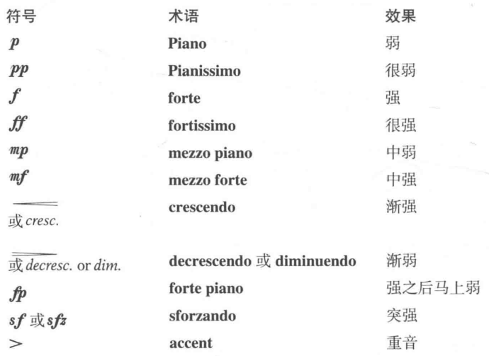
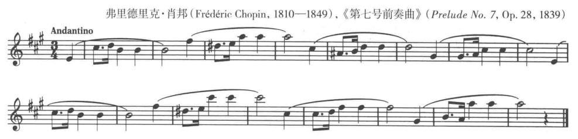
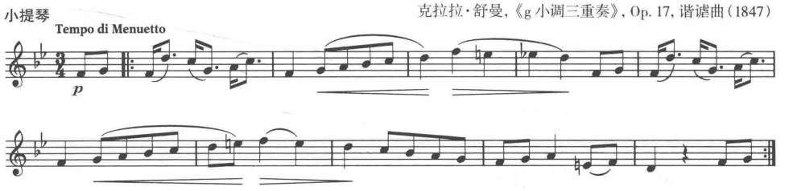
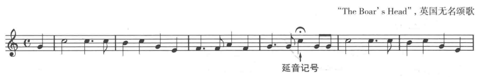
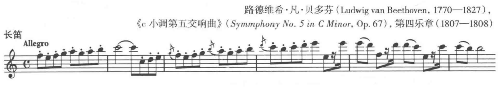
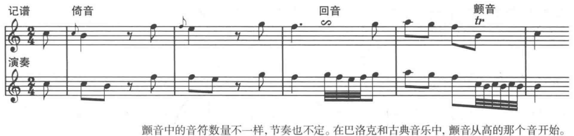

## 力度记号

声音的紧张度和大小用**力度信号**(dynamic signs)来表示。

常用的力度信息号， 用意大利语来表示强弱

## 终止线

终止线一般记录在一个重要乐段或一首曲子的末尾，表示结束。

一般是两条紧挨的小节线，在乐段结束时一样粗，在曲子末尾时第二条更粗。

**分句线**(phase marking), 音符上面或下面的弧线，表示每个乐句，或者呼吸。

分句的演奏方式叫做**连奏**(legato)

## 反复记号

一个段落需要重复演奏，在终止线前加两个点，并在重复开始处画相反的符号，这个记号叫做**反复记号**(repeat sign)

## 延音记号

如果需要一个音符演奏的比本身的时值长，可以通过**延音记号**(fermata)来表示。

## 速度的逐渐变化

如果速度逐渐变快，曲子上要标记**渐快**(accelerando [accel.])

如果速度逐渐变慢，曲子上要标记**渐慢**(ritarando,或ritenuto [rit.])

## 断奏和连奏

有些音符要流畅的弹奏，**连奏[legato]**, 连奏的音符被一条弧线连起来，这些**连线**(slur)的音符在弦乐器中要一弓奏完。

有些音符弹奏时要全部分开，**断奏[staccato]**，需要断奏的音符在音符的上面或下面要加小圆点，这些记号也叫**演奏记号**(articulation signs)

## 装饰音

**装饰音**(grace note): 比正常的音符要小，一条斜线穿过符干，在拍子前，弹得很快，依附于主要音在正拍演奏。

装饰音的形式
+ 倚音(appoggiatura)
+ 颤音(trill)
+ 回音(tune)

