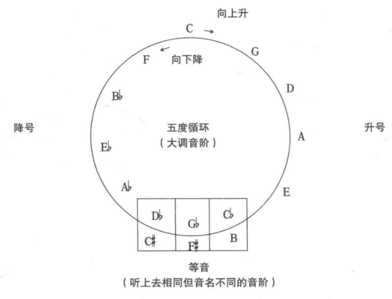
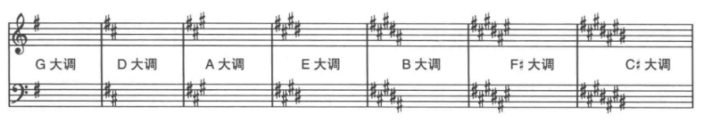
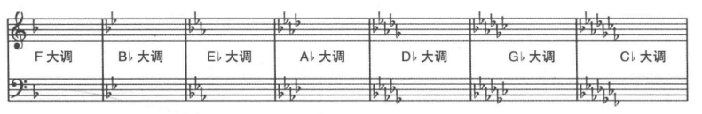

## 大调音阶的模式

除了C大调音阶，为了构成正确的全音和半音模式(第三和第四音、第七和第八音之间是半音,其他音之间为全音)，其他大调音阶都要加升降号。

**五度循环**(circle of fifths)
+ C大调没有升降号，C大调开始每高五度(7个半音)构成一个大调，加一个升号。
+ C大调开始，每低五度(7个半音)构成一个大调，加一个降号。



五度循环的推演
```

五度为7个半音，从C开始，在12个半音的音阶中循环。12次会回到原来的音阶C

> f = \x -> let n =  x *7  `mod` 12 in [C,Cs,D,Eb,E,F,Fs,G,Ab,A,Bb,B]  !! n
> take 12 $ map f [1..]

就会获得一个[G,D,A,E,B,Fs,Cs,Ab,Eb,Bb,F,C]
```

## 调号

音乐使用了那个音阶，我们就说这首曲子是哪个调。

**调号**(key signature)：加在五线谱前面，用来表示哪些音需要升降，使用了那个音阶。

调号的升降只要写一次，在任何八度这些音都要发生变化。

升号和降号要按照被升高或降低的音符的顺序来安排。

含有升号的调号



含有降号的调号



记忆技巧：根据五度循环
+ 记住升号的顺序，只要记住C#大调的调号，每次从右边减一个升号就得到其他的调号。
+ 记住降号顺序和Cb大调的调号，每次从右边减一个就得到其他的调号。

技巧2
+ 含有升号的调号，最后一个升号是大调音阶的七级音。
+ 含有降号的调号，最后一个降号是大调音阶的四级音。

## 临时变音记号

**临时变音记号**(accidental): 写在音符左边的临时变音的升号、降号和还原符号。

只在当小节有效，小节线后就失效。

