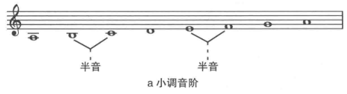
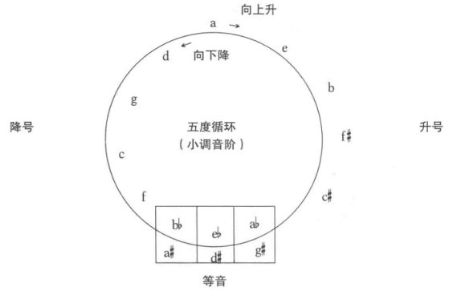
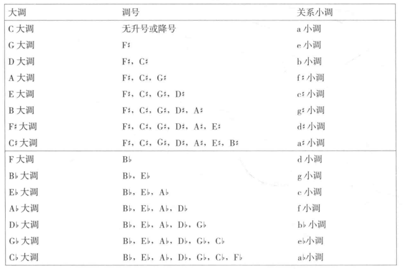

## 小调音阶

**小调音阶**(minor scale): 第二和第三音、第五和第六音之间是半音关系的音阶。也称**自然小调音阶**(natural minor scale)。

a小调音阶示例



## 小调音阶的五度循环

小调音阶也遵循五度循环，从a小调开始。



```
f = \x -> let n =  (x *7 + 9)  `mod` 12 in [C,Cs,D,Ds,E,F,Fs,G,Gs,A,As,B]  !! n

take 12 $ map f [1..]
```

## 关系大小调

拥有相同的调号(相同的升降号)的大小调为**关系大小调**(relative scales)



## 平行大小调

拥有相同主音的大小调为**平行大小调**(parallel scales)。

