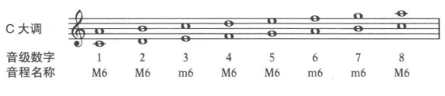
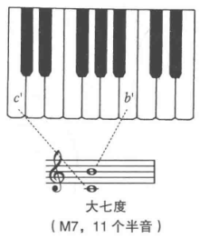
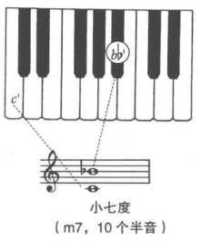
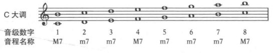
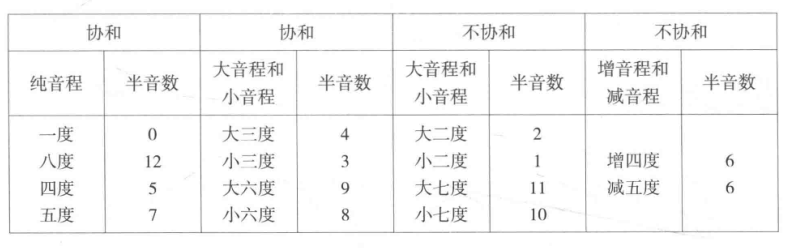
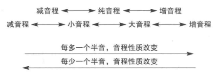

## 六度

**六度**(sixth): 六度音程包含8个或9个半音。
+ **大六度**(M6): 包含9个半音(4个全音和1个半音)。
+ **小六度**(m6)：包含8个半音(4个全音)。

大六度

小六度

大调音阶中，有4个大六度和3个小六度，大六度和小六度都有温和柔软的效果，是协和音程。

## 七度

**七度**(seventh)
+ **大七度**(M7)：包含11个半音(5个全音和1个半音)
+ **小七度**(m7)：包含10个半音(5个全音)

大七度

小七度

大调音阶中，有2个大七度和5个小七度，七度音比较刺耳和不稳定，是不协和音程。

## 所有的音程总结

## 其他增减音程

比小音程少1个半音的为减音程，少2个半音为倍减音程。

比大音程多1个半音的为增音程，多2个半音为倍增音程。

比纯音程多1个半音为增音程，少1个半音为减音程。

