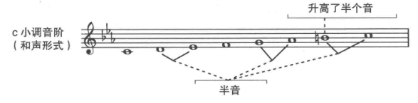
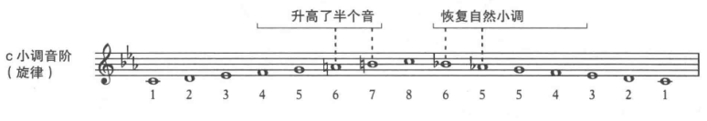

**和声小调音阶**(harmonic minor scale): 在自然小调音阶的基础上，包含了一个临时的、升高了的七级音，七级音和主音之间形成一个半音。这个半音增加了七级音对主音的紧张度，加强了调性中心的感觉。在六级和七级音之间变成了一个增二度音程(3个半音)。

**旋律小调音阶**(melodic minor scale)：为了缓和增二度的尴尬，把和声小调音阶的六级音也临时的升高。此时五级和六级、六级和七级间都是全音。上行时如此，下行时和自然小调音阶一致。

之前讲的所有音阶，都是从熟悉的作品中总结出来的。作曲家在一个小调作品中，可能使用不同形式的小调音阶。在某些片段使用和声小调或旋律小调。

