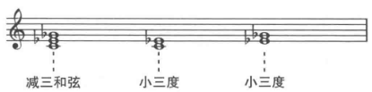
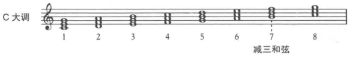
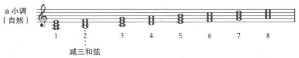
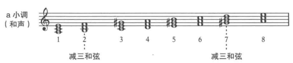
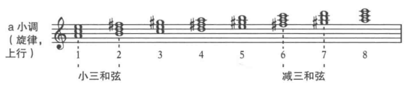
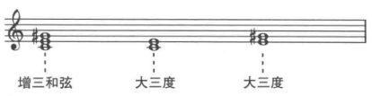
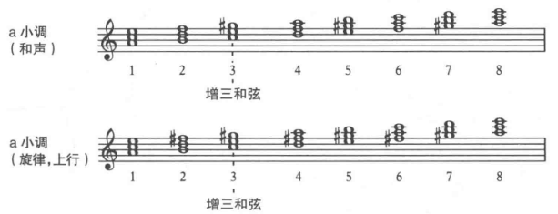
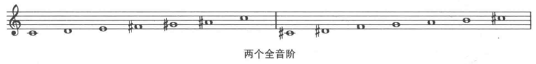

**减三和弦**：包含一个减五度音程，根音和三音、三音和五音之间都是小三度。

大调音阶中只有一个减三和弦，在七级音上。

自然小调音阶中，二级音上为减三和弦。

和声小调音阶中，二级音和七级音上为减三和弦。

上行的旋律小调音阶中，六级音和七级音上为减三和弦。

**增三和弦**：包含一个增五度音程，根音和三音、三音和五音之间都是大三度。

大调音阶中和自然小调音阶中都没有增三和弦。

只有和声小调音阶和旋律小调音阶中有增三和弦。两个音阶中，都是三级音上为增三和弦。

## 全音阶

一种只包含增三和弦的音阶，称为**全音阶**(whole-tone scale)。

大部分作曲家只在大型作品中才使用全音阶。

