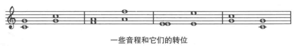

## 音程转换

将一个音程中较低的音提高八度，或较高的音降低八度，得到的新音程就是原来音程的**转位**(inversion)

音程及其转为音程之和是9。

转位之后
+ 大音程变为小音程，小音程变大音程。
+ 增音程变减音程，减音程变增音程。
+ 纯音程还是变成纯音程。

## 单音程和复音程

一个八度之内的音程为**单音程**(simple interval)。

超过一个八度的音程叫**复音程**(compound intervals)。

复音程的描述方式有两种
+ 实际的音程：九度、十度、十一度
+ 缩小到八度之内，用单音程相同的描述

