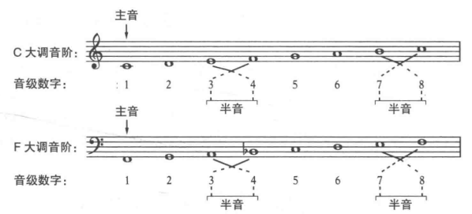
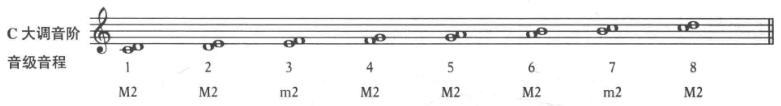

## 大调音阶

历史上的作曲家都喜欢有调性中心的音阶，包括
+ **大调音阶**(major scale)：第三和第四音、第七和第八音之间是半音，其他音之间是全音。第一个音为调性中心，也称主音(tonic)。
+ **小调音阶**(minor scale)：第二和第三音、第五和第六音之间是半音，其他音之间是全音。

典型的为C大调，C为主音；E和F，B和C之间为半音。

大调音阶可以从任何一个音开始，通过升降号来构成我们需要的全音或半音。

**音级**(scale degree): 以数字命名的(1-7)，从主音向上排列，音阶中第八个音是重复的主因，也叫做1级音。

写大调音阶和小调音阶的时候，要注意音名按照字母顺序排列。

## 大二度和小二度

**音程**(interval): 两个音高不同的音在一起就会形成音程。

从一个音到下一个相邻的音的距离叫做**二度**(second)。
+ 距离为半音，称为**小二度**(m2)
+ 距离为全音，称为**大二度**(M2)

**注意：必须包含两个相邻的音名的音才能叫做二度**。因此，在大调和小调音阶中，一定要按照字母顺序排列，相邻的音才会是二度。

C大调的二度示意

 ## 旋律音程和和声音程

 **旋律音程**：音阶和旋律中的音程。

 **和声音程**：同时发声的音程。
 
 ## 两种系统唱法

 音节: do、re、mi、fa、so、la、ti、do

 + 系统1：大调主音是do, 小调主因是la。 主音为1，高八度的主音为8。
 + 系统2：音节用来唱固定的音高，C为do，D为re。

 升调时，元音唱成i (di, ri, fi, si, li)

 降调时，元音唱成e (me, se, le, te), 除了 ♭D 唱成ra

 