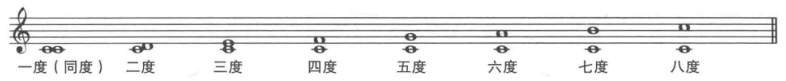
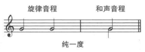
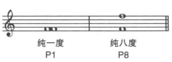
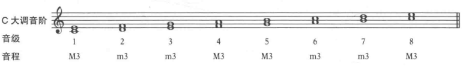

## 音程的名词

音程的名称包含两个部分
+ 音程的度：二度、三度(third)等
+ 音程的性质：大、小、纯。

## 纯音程

**纯一度**(unison)(P1): 同一时间重复同一个音，或同时发出同一个音。

**纯八度**(P8): 由两个音名相同但相隔八度的音组成，包含12个半音。

纯音程没有大小之分。

## 大三度和小三度

三度音程有两种
+ **大三度**(M3)：包含2个全音(4个半音)
+ **小三度**(m3)：包含1个全音和1个半音(3个半音)

C大调三度音程示例

## 不协和与协和音程

以和声的方式弹奏所有音程时，在音响紧张度上有很大的不同。
+ **不协和音程**(dissonances)：刺耳，不稳定的感觉。如二度音程。
+ **协和音程**(consonancess)：发声比较温和的音程，三度和八度音程。
+ **完全协和音程**(perfect consonancess)：最具融合度的音程。

