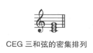
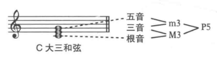
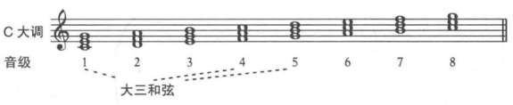
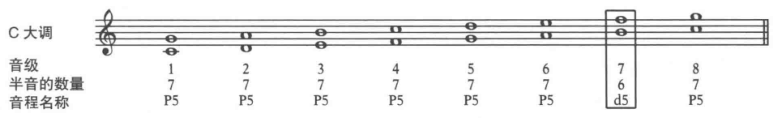

## 三和弦

三个及以上的音一起发声，就会构成**和弦**(chord)。

和弦有很多种，最基础的是**三和弦(triad)**。

三和弦中的音何以调换顺序，或者在不同的八度演奏，但是和弦里的音音名相同。

三和弦中的三个音分别为
+ 根音(root)
+ 三音(third of the triad)
+ 五音(fifth of the triad)

三和弦以根音音名和和弦性质一起命名。

把分布在不同八度的音符按照三度排列组合，称为密集排列(simple position, 也称简单排列)。

三和弦密集排列示例

## 大三和弦

**大三和弦** 下面两个音构成大三度音，上面两个音程构成小三度音程的三和弦。

C大三和弦

如果C大调的每个音上都构建三和弦，并且只能使用音阶里的音，那么就会有3个大三和弦。分别是第一、第四和第五个音级上(C、F、G)

只有3个大三和弦是全部白键构成的，分别是C大三和弦、F大三和弦、G大三和弦。其他的大三和弦都要在音上升降号来形成纯五度关系。

## 纯五度

三和弦的最低音和最高音构成一个**五度(fifth)**。

在大三和弦中，五度音程包含7个半音，产生全新的音响效果，称为**纯五度**(P5)。

**减五度音程**(d5)：在大调音阶中，每一个音上都构成一个五度音程(b' f'')，除了一个音级包含6个半音之外，其他的音级都是含7个半音的纯五度，这个6个半音的音程称为减五度音程。

**减音程(diminshed)**： 比正常音程少一个半音。

C大调音阶中的减五度

纯五度音程是构成和声的基础，最早和追溯到9世纪。

中世纪后，作曲家都尽量避免使用纯五度音程。

到19世纪末，德彪西(Debussy)等作曲家又开始对纯五度着迷。

**平行五度**(parallel fifths): 指乐曲的两个声部隔开纯五度作平行进行。

