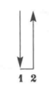
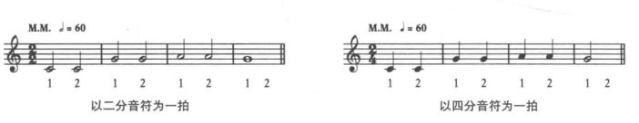
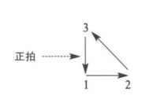
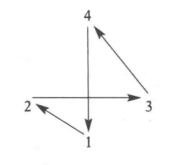
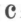
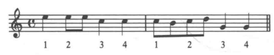
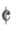

## 二拍子

**二拍子(duple meter)** 里，音乐的律动是两拍一组。第一个律动是每一个小节到达的点，所以会被强调。第二个律动相对较弱。

指挥手势：第一拍向下挥(**正拍**, downbeat), 第二拍向上挥(**起拍**, upbeat)

示例

注意，上面2个例子记谱上不一致，但是音响上完全一致，但是拍子的速度一致。**速度标记(tempo marking)**和音符共同决定实际的音符时长。

## 三拍子

**三拍子(triple meter)** 里，音乐的律动是三拍一组。

三拍子中，第一拍是强拍。

指挥手势

## 四拍子

**四拍子(quadruple meter)** 结合了2个二拍子，第一拍是强拍，第三拍是次强拍。

指挥手势

`4/4`拍也叫做**标准拍子(common time)**, 可以用下列记号标记

示例

在标准拍子的符号加一个竖线，就标称了二拍子(alla breve), `2/2`拍可以用下列记号标记

## 单拍子中节拍的细分

单拍子中，单位拍的时值都可以分为两个部分或四个部分。

当拍子被分成半拍时值，单位拍包含两个音符。当拍子分为四份时，单位拍包含四个音符。

在数半拍音符时，最重要的是保持速度的稳定和时值的平均分配。(1 da 2 da 或 1 te 2 te来数)

当短的音符位于拍子开始1/4处时，产生一个生动的节奏，称为"苏格兰促音"，短音符有很强的重音，通常运用在苏格兰民族舞蹈，爵士乐中。

