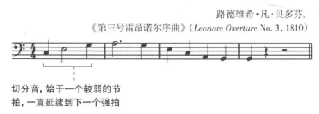
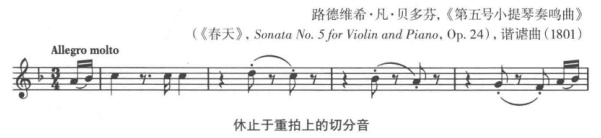
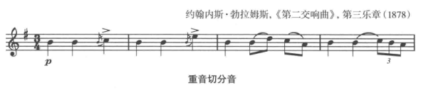

**切分(syncopation)** 当音乐的重音从期待的强拍转移到一个弱拍上时。

三种强调弱拍的方式
+ 从弱音开始，并和之后的强拍连起来
+ 将强拍音休止，只能听到弱拍音
+ 在弱拍而不是强拍上加强力度

## 切分音示例

延续到强拍的切分音

休止与强拍的切分音：会产生一种气喘吁吁、开玩笑的效果，这类效果在快速时更加明显，在一些**诙谐曲(scherzo)**常使用

重音切分音

经常使用重音或倚音来强调第三拍。

加重音的切分音通常会要求在重音与非重音间做清晰的对比。
+ **fp** (forte piano) 强，然后突然弱
+ **sfz** (sforzando) 强烈的重音
+ **sfp** (sforzando piano) 强烈的重音，然后立即弱

## 节拍内的切分音

在节拍内使用的强调弱拍而压制强拍的切分音。

民歌、灵歌和爵士音乐中常会使用半拍或更小时值的切分音。

节拍内的切分音模式是将一个八分音符放入两个十六分音符之间。

**拉格泰姆(ragtime)** 中，最典型的切分音是十六分音符模式。

