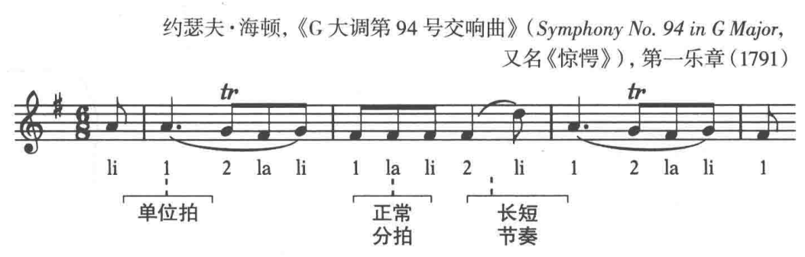

## 什么是复拍子

**复拍子(compound meter)** 单位拍可细分为平均的三个部分，复拍子中的单位拍通常是一个附点音符。

复拍子的效果好像每个拍子都是三连音。

复拍子中，拍号下面的数字是节拍中的音符时值，拍号上面的数字是一个小节中的音符数量而不是拍子的数量，一般是3或3的倍数。

## 以一个附点音符为单位拍的复拍子

最普遍的复拍子以一个附点四分音符为单位拍，并能细分为八分音符的拍子。

拍号是`6/8`、`9/8` 或 `12/8`

## 以其他附点音符作为单位拍

也有以附点二分音符，附点八分音符作为单位拍的拍子。

## 特殊的节奏：三对二

在6个八分音符的小节内转换重音，会有两种效果
+ 从两组每组三个八分音符的拍子(复拍子)，变为三组每组两个八分音符(单拍子)。
+ 或者从三组变为两组
这两种效果叫做三对二。

