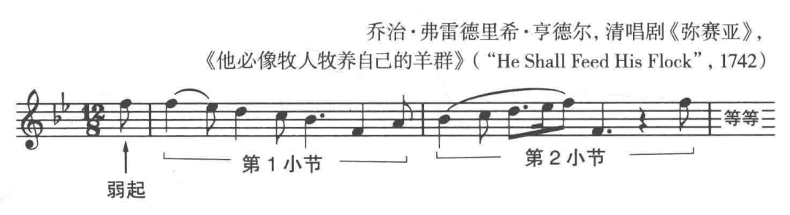
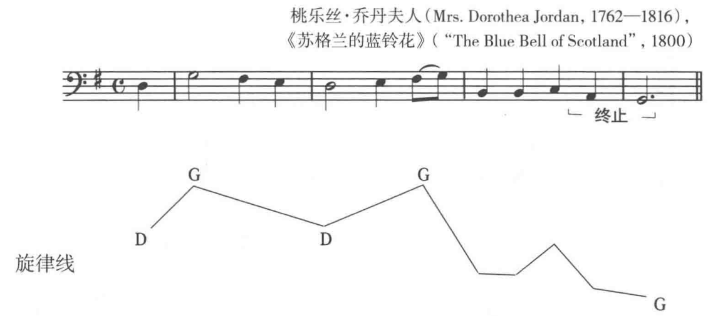
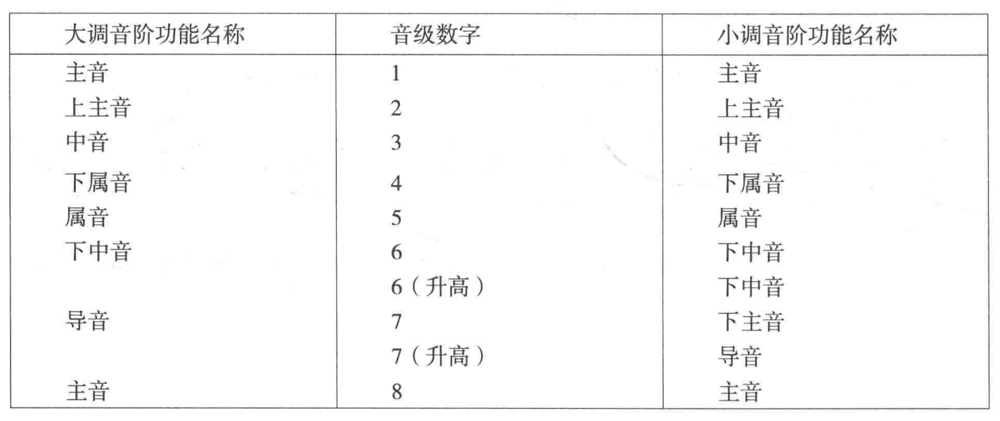
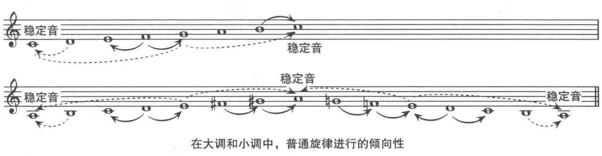

**旋律(melody)** 是一系列音连续发出的声响。体现了两方面的运动：时间的运动(节奏)和音高的运动(旋律线 melodic contour)。

## 乐句

**乐句(phase)** 音乐演奏中的句子，每个旋律都可以分为多个乐句。乐句的长度通常为2-8个小节，18-19世纪的音乐中一般为4个小节。

### 乐句的开始

一个乐句可以从小节的第一拍开始。

也可也通过旋律的运动进入小节的第一拍，此时，第一个强拍之前的音叫**弱起(anacrusis)**

弱起所在的小节不是一个完整的小节。在有弱起的旋律中，第一个强拍出现的小节为第一小节。

如果一条旋律的第一个乐句以弱起开始，那么后面的乐句通常也会这样。因此，通常带有弱起的旋律最后一个小节都会减少相应的拍子(开始时弱起使用的拍子来自最后一个小节)。

### 乐句的终止

每个乐句都有开始、中部和结尾。乐句从始至终，节奏和旋律结合起来产生了一种运动的感觉，而运动的目标就是一个休止的点。旋律进行运动通向的这个重点就是**终止(cadence)**
+ 强终止：乐句的最后一个音符落在小节的强拍上时。
+ 弱终止：乐句的最后一个音符落在小节的弱拍上时。

## 音阶中的各音符名称

音阶中的音符名称能表示它们在旋律中和由它们构成的和声中的功能。

大调音阶从下往上分别是
+ 主音(tonic)
+ 上主音(supertonic)
+ 中音(mediant)
+ 下属音(subdominant)
+ 属音(dominant)
+ 下中音(submediant)
+ 导音(leading tone)

最重要的音是：主音、属音和下属音。

在小调音阶中，个音级名称一样。除了自然小调和下行旋律小调的七音，七音比主音低大二度，称为**下主音(subtonic)**

## 调式中的稳定音与不稳定音

+ **不稳定音** 有强烈向一个目标移动的音。导音、旋律小调中升高的六级音...，最突出的是导音。
+ **稳定音** 不稳定音的移动目标。组成主和弦的三个音

两种普遍的终止模式
+ 导音向上解决到主音
+ 上主音下行解决到主音

## 终止中的一些旋律模式

+ 从属音解决到主音，要么向上四度，要么向下五度
+ 带装饰的终止：在强拍终止的情况下，小节线前先出现主音

## 弱起中的一些旋律模式

+ 从属音跳进到主音
+ 音阶的三级音向下移到主音，或主音向上移动到三级音
+ 分解三和弦

