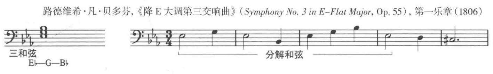

## 级进和跳进

旋律的进行方式
+ **级进进行(conjunct motion)** 音程是全音或半音，旋律的线条是平滑的
+ **跳进进行(disjunct motion)** 包含跳跃的大音程，旋律线条是参差的

## 通向高潮的旋律运动

一些旋律向上走到最高一个音，这个音就是乐句的高潮。高潮可以在乐句的最后，与终止一致。

另一些旋律会在乐句中达到高点，终止时稍微降到低一点的音。

旋律也可以一直下行到最低音结束。

还有一些音会在一个音高上保持一段时间，积累紧张度，直到最后的运动引领旋律走向终止。

## 分解和弦形成的旋律中的跳进进行

当旋律的运动有很多跳跃时，通常会形成分解和弦的模式。

旋律可以只由音阶的一级上的和弦(主三和弦)构成。

在那些由分解和弦构成的旋律中，级进与跳跃进行是结合一起的。

## 由其他三和弦构成的旋律

属三和弦和下属三和弦也会构成旋律

用来美化旋律，但不属于和弦的音符，称为 **和弦外音(nonharmonic tone)**

## 二声部和多声部运动

两个声部移动方向的关系叫做 **进行(motion)**。

两个声部移动方向一致，叫做 **同向进行(similar motion)**

两个声部方向相反，叫做 **反向进行(contrary motion)**

一个声部不动，另一个声部向此声部运动，叫做 **斜向进行(oblique motion)**

两个声部一直保持相同方向相同距离运动，叫做 **平行进行(parallel motion)**

