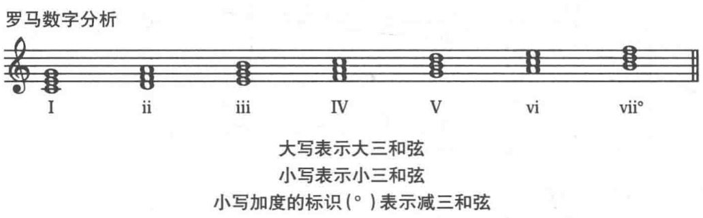

**和弦符号(chord symbol)** 在每个三和弦下面加罗马数字表示它们音阶之间的关系。
+ 大写为大三和弦
+ 小写为小三和弦
+ 小写的加`。` 表示减三和弦。

## 三和弦的位置--转位

为了让声部更加平缓并增加音乐的表现力，作曲家在选择和弦排列的同时，也会选择改变三和弦的三个音的位置。
+ 根音位置：根音在最低音
+ 第一转位：三音在最低音
+ 第二转位: 五音在最低音

也会通过和弦转位的方式来增加声部。

