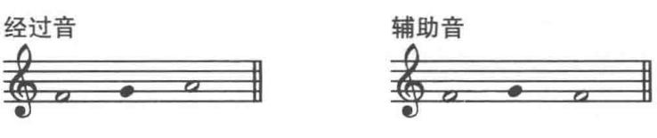

## 进行

音阶上的任何音级都可以建立大三和弦或小三和弦，当作曲家在作品中将它们连接起来时，就形成了 **和弦进行(chord progression)**

最普遍的进行是主三和弦、下属三和弦和属三和弦。即I、IV和V。

## 正三和弦与五度循环进行

**正三和弦(primary triads)**  即第I、IV和V音级的三和弦。

正三和弦连接是最常见的和弦连接，当两个相邻的和弦根音是五度循环关系时，就称为**循环进行(circle progression)**
根音向上或向下纯四度或纯五度。

在所有欧洲传统音乐中，循环进行都是所有调性音乐中最重要的一股推动力。

## 和弦外音

旋律中属于和弦的音叫做和弦音，其他的音叫和弦外音。

出现在两个音高不同的音之间的和弦外音叫做经过音。

出现在两个音高相同的音之间的和弦外音叫做辅助音。

## 和声终止

节奏终止、旋律终止和和声终止。

和声终止中，除了节奏和旋律，还包括和弦进行的终止。

分类：按照终止的和弦
+ **全终止(authentic cadence)** 终止在主和弦上。
+ **半终止(half cadence)** 终止在属和弦上。

按照终止的音
+ **完全终止(perfect candence)** 终止在主音上(主和弦的根音)
+ **不完全终止(imperfecet candence)** 终止在三级或五级音上(主和弦的三音或五音)

