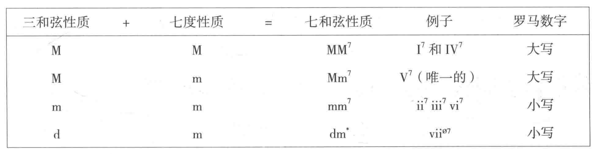
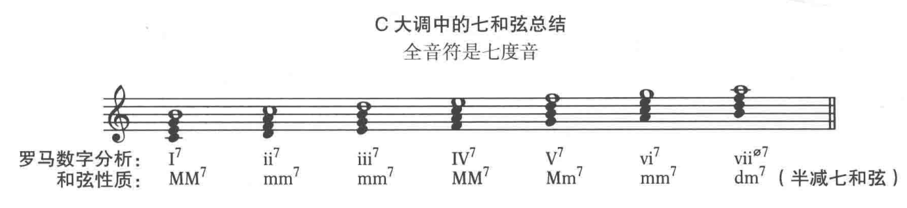
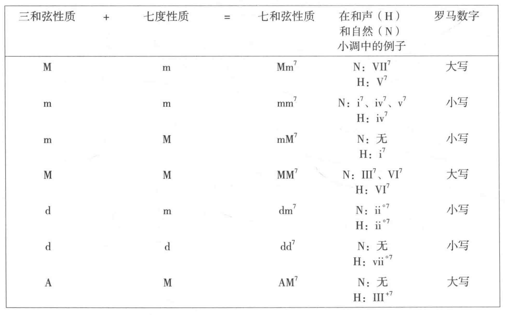
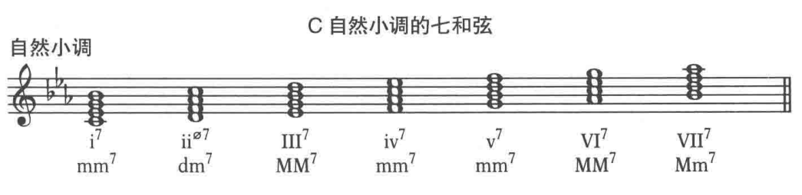
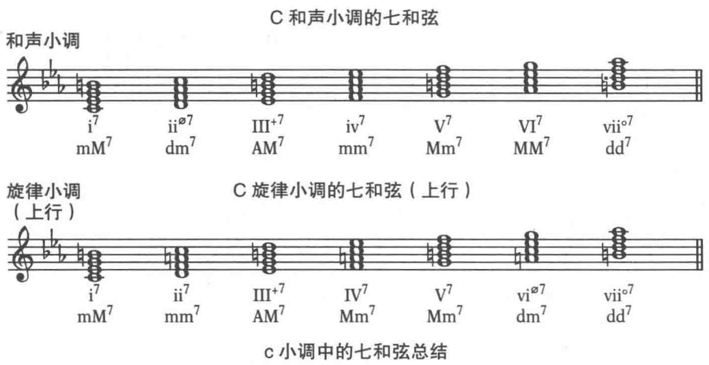
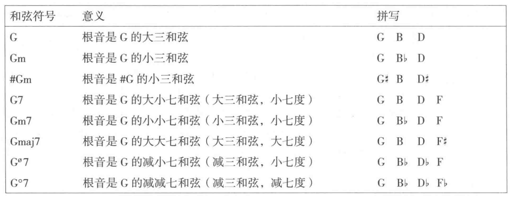

**配和声(harmonizing)** 编制一系列有趣的和声为一条旋律伴奏。

## 七和弦

在三和弦的五度上增加一个三度音程，这个新的和声单元称为**七和弦(seventh chord)**。包含四个音：根音、三音、五音、七音。

分类
+ 大大七和弦(MM7): 大三和弦 + 大七度
+ 小小七和弦(mm7): 小三和弦 + 小七度
+ 大小七和弦(Mm7): 大三和弦 + 小七度
+ 小大七和弦(mM7): 小三和弦 + 大七度
+ 半减七和弦(dm7): 减三和弦 + 小七度
+ 减减七和弦(dd7): 减三和弦 + 减七度
+ 半减七和弦(dm7): 减三和弦 + 小七度

## 大调音阶中的七和弦

其中`。`为三和弦和七和弦都是减的，加一个斜线表示只有三和弦是减的。

## 小调音阶中的七和弦

自然小调音阶

和声小调音阶和旋律小调音阶

## 用和弦符号和罗马数字分析和声

爵士乐和流行乐都通过 **歌本(fake book)** 的形式出版，歌本有 **缩谱(lead sheets)** 组成。包含三个部分
+ 一条旋律线
+ 旋律上方的和弦符号(在小节线上，表示和声变化和节奏关系)
+ 五线谱下方的文字说明

**和弦符号(chord symbols)** 与罗马数字分析不同，后者是为了显示任何调性中的和声关系，大调和小调。

罗马数字分析
1. 标明三和弦根音的音阶音级
2. 大写罗马数字表示大三和弦，小写罗马数字表示小三和弦
3. 增三和弦大写罗马数字后面加`+`, 减三和弦小写罗马数字后面加`。`
4. 数字用来表示三和弦上面增加的音符
5. 数字也表示三和弦根音与上面音符组成的音程
6. 数字还表示三和弦上面的和声扩展

和弦符号
1. 大写字母表示三和弦的根音
2. 增加的音符写在大写字母的后面
3. 大三和弦只用一个大写字母表示
4. 小三和弦在大写字母后加`m`或`mi`
5. 减三和弦加`。`, 增三和弦用`+`
6. 数字表示三和弦的扩展，并表示了根音上方的音程。
7. 呼吸记号 `’`  表示乐句结尾，在下一个和弦符号出现前，要持续演奏之前看到的和弦

