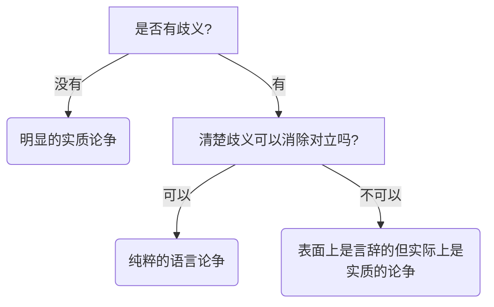

## 论争、言辞之争与定义

三种不同类型的论争
+ **明显的实质论争**：双方在信念或态度上明确的对立。**不存在言辞歧义，双方确有歧见**
+ **纯粹的语言之争**：双方根本没有实质歧见，但却好像有歧见。语言的误解和误用是症结所在。在这种情况下，良好的定义对相互理解是非常关键的。**存在言辞歧义，双方没有歧见**
+ **表面上是言辞的但实际上是实质的论争**：争执超出了词语不同用法的范围。这种争论也被称为**标准之争**或**概念之争**。**既存在言辞歧义又有歧见**

如果论争属于纯粹的语言之争，就可以通过提供能够消除关键歧义的定义来解决。

如何辨别论争的类型

## 定义的类型和论争的解决

定义通过揭示和消除歧义，可以有效地解决纯粹语言之争。

注意：

**定义总是符号的定义，只有符号才需要定义来说明**

我们可以定义"椅子"这个词，但不能定义椅子本身。因为椅子不是一个具有意义从而需要说明的符号。虽然在表达定义时，我们有时谈论被定义的符号，有时谈论符号所指的事物。

被定义的符号称为**被定义项**

用来说明被定义项的符号或符号串称为**定义项**

二者关系
+ 错误的说法：定义项是被定义项的意义
+ 正确的说法：**定义项是与被定义项具有相同意义的另一种符号或符号串**

**定义主要用于消除歧义**

五种定义方法

+ 规定定义
+ 词典定义
+ 精确定义
+ 理论定义
+ 说服定义

### 规定定义

**源于随意的一个意义指派，被恰当地称做规定定义**，也称名称定义或词语定义。

引进新符号的人具有规定给它什么意义的完全自由。符号不必是完全新的，它可以仅在定义出现的语境中是新的。

规定定义不真也不假，也没有确切和不确切之分。

规定定义应当被视为运用被定义项去意指定义项所意味的东西的一个建议或方案，或被视做那样的一个请求或指令。

规定定义是指令性的而不是信息性的。

可以通过规定本身是否清楚，是否有利来进行评估。

### 词典定义

下定义的目的是为了消除歧义或增加个人词汇，而被定义项不是新词，而是已经具有的固定用法，这种定义叫做**词典定义**。不能给予被定义项一个新的意义，而是报告其已经具有的意义。

词典定义可以是真的或假的。

规定定义与词典定义的区分
+ 规定定义的被定义项引进了新的意义，没有真假之分。
+ 词典定义的被定义项拥有一个先在和独立的意义，没引入新的意义，有真假之分。

定义是规定定义或词典定义，与被定义项是否指称某个真实存在的事物无关。

词汇的用法是一个统计问题，不可避免的服从统计变化。

要注意大量使用者对词的使用方式。

### 精确定义

**精确定义用来减少模糊性**。

模糊性和歧义是不同的
+ 歧义是一个词项具有多重意义，并且在特定语境中不清楚它要表述的是哪个意义。
+ 模糊性是存在临界状况，人们不确定该词项是否适用该状况。

**所有的词项都具有一定程度的模糊性**

清楚词项的模糊性不能诉诸词项的日常用法，日常用法没有足够的准确性，临界状况的断定常常必须超出日常语言的范围。而帮助解决临界状问题的定义将超出普通用法表示的范围，这种定义就是**精确定义**。
+ 精确定义不同于规定定义，被定义项不是新词语。
+ 精确定义也不同于词典定义，因为不是给出已有用法的报道，而是要区分临界状况，超出固定用法。

法律中常用精确定义。

### 理论定义

词语的理论定义，就是试图给出词项所适用对象的一种理论上充分或者科学上有用的精确描述的定义。

理论定义寻求全面的理解。

理论定义完全超出对词项本身的关心，而是在追求一种理论，把那些重要词语的定义阐释的完整而充分。

### 说服定义

定义可能被精确构造出来并用来说服他人，即通过影响读者或听者的态度或激发他们的情感以解决争论。

说服定义常见与政治领域

情感色彩可以被偷偷地注入一个定义语言里，而这个定义却是伪称准确并表面上显的客观的。我们必须警惕被说服定义愚弄。

## 外延和内涵

定义的作用是表明一个词项的**意义(meaning)** , 而意义这个词有两层**含义(sense)**

**普遍词项**： 可以运用于多于一个对象的类(class)的词项，也称作类词项。

普遍词项的意义的两层含义

+ **外延**： 一个普遍词项可以正确适用的对象的集合构成该词项的外延。
+ **内涵**： 一个普遍词项指谓的所有对象并且仅仅这些对象拥有的属性集，称为该词项的内涵。

外延意义和内涵意义的关系

+ 每个普遍词项都有一个内涵意义，又有一个外延意义。
+ 一个词项的外延可能不断发生变化，同时内涵也在不断变化，二者是同等恒定的。
+ 内涵决定外延，外延无法决定内涵。不同内涵的词项可能具有相同的外延，但是具有不同外延的词项不可能具有相同的内涵。
+ 反变规律：内涵的增加伴随着外延的不变或减少。
+ 有些词项的外延可能是空的(独角兽)。区分意义与所指，许多有价值的词项都不存在所指。

## 外延定义

外延定义就是指被定义的普遍词项所适用的对象的汇集。

### 列举定义

外延定义最简单的方法就是**列举其指谓的对象** 。这种方法的局限性:

+ 不同内涵的词项可能具有相同的外延。
+ 外延可完全列举出来的词项是很少的。如果只是部分列举，就可能导致列举的对象包含在许多不同的普遍词项的外延之中，无法明确支出外延代表的词项。

可以通过列举子类来定义，缓解上面的问题。

但是，无论如何，通过列举定义来完全确定被定义项的意义，在逻辑上都是不充分的。

### 实指定义

**实指定义是列举定义的一个特殊类型，通过用手或其他姿势治者对象来定义，而不是通过命名或描述被定义词项指谓的对象来定义** 。

实指定义的局限性

+ 列举定义的所有局限性。
+ 地域局限，无法定义看不到的事物。
+ 姿势歧义：无法完全明确指的是什么东西。

姿势歧义可以通过增加一些描绘短语来解决，称为**准实指定义**。

我们学习使用语言的基本途径是观察和模仿，而不是定义。

有些词无法在外延上进行定义(例如独角兽), 但仍具有意义。

## 内涵定义

 内涵指由词项指谓的所有对象共有且仅为这些对象特有的属性。

内涵定义有三种形式

+ **主观内涵**：说话者认为的词项指谓的对象具有的属性集。因人而异，私人解释而非公共意义。
+ **客观内涵**:  词项外延的所有对象所共有的属性全集。要求全知，但是没有人能做到全知。
+ **规约内涵**： 通过非正式的承诺，人们都同意的标准，建立的普遍词项的规约。是公共的，也不要求全知。

**通常来说，内涵这个词指的就是规约内涵** 。

指示规约内涵的常用方法

+ 同义定义
+ 操作定义
+ 属加种差定义

### 同义定义

提供另一个意义已经被理解的词，而且它与被定义的词具有相同的意义。

常用在外语学习时。

优点： 容易、方便、实用。

缺点：

+ 很多词没有同义词
+ 不够精确，容易引起误解。
+ 对于完全外来的和令人费解的概念，任何同义词都一样令人费解。

### 操作定义

由物理学引入

把被定义项与一组可描述的动作或操作联系在一起。

**操作定义**： 指词项被正确的运用到某个给定场合，当且仅当那个场合中，特有的操作行为会产生特有的结果。

常用在自然科学和社会科学领域。

极端的经验者认为，一个词项只有在能被操作定义时才有意义。

### 属加种差定义

也称为属种定义、划分定义。

具有最广泛的可用性，有人认为这是唯一一种真实的定义。

属和种(不同于生物学术语)

+ 属：父类
+ 种：子类

种差： 把一个种的元素与相同属的其他种的元素区分开的性质。

**属加种差定义**:  通过包含被定义的那个种的较大的属，以及区分被定义的元素的那个种与同属的其他种的种差来定义词项。

局限性:

+ 无法定义简单的不可再分析的属性，如光谱的颜色等。
+ 无法定义大全类(universal class), 即**最高的属** ，包括形而上学的最终范畴(物质、本体、存在等)

对五种定义类型的每一种，都可以用上述的内涵定义的方法进行定义。

## 属加种差定义的规则

这些规则不能帮我们构建更好的内涵定义，但是可以作为评估词典定义的标准。

+ 定义应当揭示种的本质属性。即被定义项的规约内涵。
+ 定义不能循环。被定义项本身不能出现在定义项中。
+ 定义既不能过宽，又不能过窄。即定义项指谓的事物既不能比被定义项的事物多，也不能比被定义项的事物少。
+ 定义不能用歧义、晦涩或比喻的语言来表述。
+ 定义在可以用肯定的地方就不应当使用否定定义。

就大多数目的来说，内涵定义优于外延定义。在内涵定义中，属加种差定义通常是最有效的。

