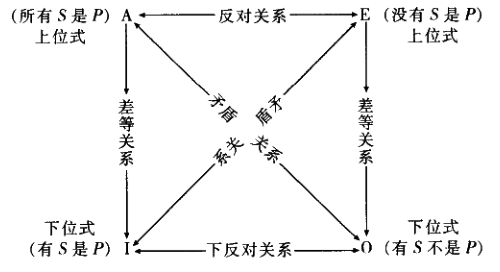
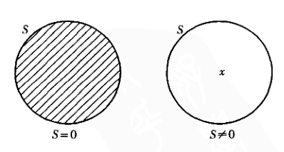
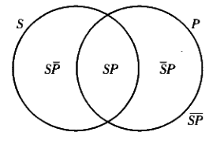
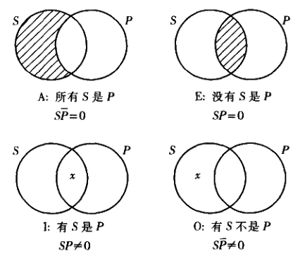

## 演绎理论

前几章在探讨语言及其对论证的影响，本章开始讨论论证本身。

**演绎论证**: 其前提被要求为结论提供决定性基础。一个演绎论证或者是有效或者是无效。

**演绎理论** 旨在**阐明有效论证的前提与结论之间的关系，为评估演绎理论提供方法** 。即演绎理论要**给出区别有效演绎和无效演绎的方法** 。

两种演绎理论

+ 古典逻辑，也称亚里士多德逻辑 (本书5、6、7章)
+ 现代逻辑，也称现代符号逻辑  (本书8、9、10章)


亚里士多德 《工具论》是其关于推理的论述集。


## 直言命题及其类别

亚里士多德对演绎的研究主要集中在范畴(categories)与类(classes)的命题，被称为**直言命题** (categorical)

直言命题是演绎理论的基石。

**类** : 共有某种特定属性的所有对象(objects)的汇集。

类之间的关系

+ 包含关系：第一个类的所有元素都是另一个类的元素，则称第一个类包含于第二个类。
+ 部分包含:  第一个类中有元素是另一个类的元素，也有不是另一个类的元素，则称第一个类部分的包含与第二个类。
+ 相互排斥: 两个类没有共同元素。

类之间的关系被直言命题肯定或否定，可以形成四种命题形式

+ **全称肯定命题(A命题)** : 断言第一个类包含于第二个类。所有S都是P。S为主项，P为谓项，都是类。完全肯定。
+ **全称否定命题(E命题)** : 断言第一个类有第二给类是完全排斥的。没有S是P。完全否定。
+ **特称肯定命题(I命题)** : 断言第一个类中至少有一个元素是第二个类的元素。有S是P。部分肯定。
+ **特称否定命题(O命题)** : 第一个类中至少有一个元素不属于第二个类。有S不是P。部分否定。

许多逻辑理论都以这四种命题为基础来建立。


## 质、量与周延性

### 质

每个标准的直言命题或是肯定的或是否定的，这叫做命题的**质** 

+ 如果一个命题肯定了类与类之间的包含关系，不管是全部还是部分肯定，那么它的质就是肯定的。全称肯定命题和特称肯定命题的质都是肯定的。

+ 如果一个命题否定类与类之间的包含关系，不管是全部还是部分否定，那么它的质就是否定的。全称否定命题和特称否定命题的质都是否定的。


### 量

每个标准的直言命题或是全称的，或是特称的，这称为直言命题的**量**

+ 如果一个命题述及主项所指称的类的所有元素，那么它的量就是全称的。全称肯定命题和全称否定命题的量都是全称的。
+ 如果一个命题只述及主项所指称的类的某些元素，那么它的量就是特称的。特称肯定命题和特称否定命题的量都是特称的。

通过量和质可以唯一描述一个标准式直言命题。


### 标准式直言命题的一般模式

```
量项 主项 联项 谓项
```

+ 量项： 表明量的动词(有、没有、所有)
+ 联项：连接主项和谓项的动词(是，不是)

> 示例
>
> 所有   正方形   都是    四边形


### 周延性

标准式直言命题指称的都是对象的类, 命题被看作是关于类的. 一个命题可能谈及一个类的全部元素, 也可能只谈及一些元素.

**周延**: 如果一个命题述及了某个词项所指称的类的全部元素,则称该词项在这个命题中是周延的.

在标准式直言命题中

+ 全称肯定命题主项是周延的,谓项是不周延的.
+ 全称否定命题主项是周延的,谓项是周延的.
+ 特称肯定命题,主项是不周延的, 谓项是不周延的.
+ 特称否定命题,主项是不周延的,谓项是周延的,

总结

+ 全称命题主项是周延的, 特称命题主项是不周延的.
+ 肯定命题谓项是不周延的, 否定命题谓项是周延的.


##  传统对当方阵

 具有相同主项和相同谓项的标准直言命题,可能在量上有所不同,也可能在质上有所不同, 称之为**对当关系**(opposition)

各种不同的对当关系

+ **矛盾关系** : 一个命题是另一个命题的拒斥或否定, 它们**既不能同真也不能同假** . 如果**两个命题主项,谓项都相同,而质,量都不同**,那么它们就是矛盾的. A与O, E与I互为矛盾.
+ **反对关系** : 两个命题**不同时为真, 由一个真可以推出另一个为假. 两个命题也可以同时为假**.
  - 对与必然真的命题, 没有反对命题. 
  - 对于**偶真的**(非必然真)命题, 具有相同主项和谓项的A和E互为反对命题.
+ **下反对关系**: 两个命题**不能同假,但可以同真.**如果两个命题**是特称的,且主项, 谓项分别相同而质不同** , 那么它们之间是下反对关系. I和O是下反对关系.
  - 如果I和O中有一个命题必然为假, 则不存在下反对命题.
  - 偶真的命题,才会存在下反对命题.
+ **差等关系**:  两个命题具有**相同的主项和谓项, 质相同但是量不同** . A命题和相应的I命题, E命题和相应的O命题构成等差关系. 全称命题与相应的特称命题之间构成的对当关系叫等差关系,其中全称命题叫**上位式**, 特称命题叫**下位式** . 在等差关系中, 上位式的真蕴含下位式的真.

根据上面讨论的四种关系, 可以得到一个对当方阵.



对当方阵为把握一些基本形式的有效性提供了逻辑基础.

论证

+ 直接论证: 从唯一前提出发,不经过任何中介,得到结论.
+ 间接论证: 从一个以上的前提出发,得到结论.

以对当方阵为基础, 给定任意一个命题的真假情况, 可以直接得到另外的3个命题的真假情况.


## 其他直接推论

除了对当关系的直接推论外, 还有一些其他的直接推论.

### 换位法

仅通过交换命题中的主项和谓项的位置而进行的推论.

换位法直接推论中的前提叫做**被换位命题** , 结论叫做**换位命题** .

对于E命题和I命题, 换位法肯定是有效的.

对于A命题,  无法通过换位推出换位A命题. 但是, 可以通过等差关系得到I命题, I命题再通过换位得到换位命题, 这种推论称为**限制换位**, 即交换主项和谓项的位置,然后把量由全称改为特称.

O命题的换位一般是无效的.

E命题的换位命题仍是E命题, I命题的换位命题仍是I命题, A命题的限制换位命题是I命题,是**不等价的**


### 换质法

一个类就是具有某种共同属性的所有对象的汇集, 这种共同竖井叫做**类的定义特征**, 任何一个属性都可以确定一个类.

所有的类都有一个**补类** , 即不属于原来的类的所有东西的汇集. S的补是非S.

按照双重否定法则, 非S的补是非非S, 也就是S.

命题换质, 就是改变其质, 并用谓项的补替换原来的谓项.

换质法应用到任何标准式直言命题,都是有效的直接推论.

A命题换质后得到E命题, E命题换质后得到A命题, I命题换质后得到O命题, O命题换质后得到I命题.

换质法直接推论的前提叫做被换质命题, 结论叫做换质命题.

所有标准式直言命题与其换质命题在逻辑上都是等价的.


### 换质位法

将主项换为原命题谓项的补, 并将谓项换为原命题主项的补.

对任何一个命题进行换质位,就是对原命题先换质,再换位,再换质.

换质位法对A命题是有效的, A命题换质位之后仍是A命题.

换质位法对O命题也是有效的, O命题换质位之后仍是O命题.

换质位法对I命题是无效的

对E命题是无效的, 但是可以进行**限制换质位** (先换质, 再限制换位, 再换质), 得到一个O命题.


一个有效推理,前提为真,则结论必为真. 若前提为假, 则结论可能为真也可能为假.

较好的方法是,从已知命题的矛盾命题考察., 因为假命题的矛盾命题必为真, 从后者开始的有效推理也必为真.


## 存在含义与直言命题的解释

**存在含义** : 如果说出了一个命题就肯定可某种对象的存在,那么就说这个命题具有存在含义.

特定论证中所用的命题是否有存在含义,将直接影响到该论证中推理的正确性.对直言命题必须有一个清晰, 融贯的解释, 以便确定什么东西可以由它们正确推出,同时避免错误推论.


I命题和O命题都具有存在含义，而根据等差关系， I命题可以由A命题有效的推出， O命题可以由E命题有效的推出， 则A命题和E命题也必定要有存在含义。(因为一个有存在含义的命题不可能从另一个没有同样含义的命题得到)

这样会导致一个问题，A和O是矛盾关系，必有一为真。但是，对于A命题"所有的火星人都是金发碧眼"， 以及对应的矛盾命题O命题"有火星人不是金发碧眼"，如果A和O都有存在含义，则A和O都有可能为假， 则A和O之间就不是矛盾关系。

同样可以得到I命题和O命题的下反对关系也不正确，这样对当方阵就有错误了。

这个问题有两种解决方案

### 预设

引入**预设**的概念来恢复逻辑对当方阵的地位。即**所有标准式直言命题，都预设其涉及的类均不为空，都有元素**。

预设存在的问题

+ 不能再刻画那些否定有元素存在的命题
+ 与日常语言不一致，我们说话并不假定所谈的类有元素
+ 在科学界和其他理论界，需要没有任何存在预设的推理

因此， 全面存在预设不能为现代逻辑学家所接受，需要其他解释。


### 布尔解释

布尔解释

+ I和O命题仍有存在含义
+ A和E命题与I和O命题之间的矛盾关系也保持为真
+ 全称命题A和E没有存在含义。
+ A和E之间不再是反对关系，可以同时为真。
+ I和O之间不再是下反对关系
+ A和I， E和O不再是等差关系

+ 保留了换位推理、换质位推理，但限制换位、限制换质位推理不再有效。

对当方阵中只剩下了矛盾关系。

现代逻辑学家否定了全面存在预设，我们不能再假定一个类中有元素，否则就会产生存在预设谬误，简称**存在谬误** 


## 直言命题的符号系统与图解

直言命题的布尔解释很大程度上以空类为基础。

### 符号表示

| 符号          | 说明                                 |
| ------------- | ------------------------------------ |
| $0$           | 空类                                 |
| $S's$         | S包含元素s                           |
| $S=0$         | S为空                                |
| $S\neq0$      | S不为空                              |
| $SP$          | S和P的积，由同时属于两个类的元素组成 |
| $\overline S$ | S的补类                              |

则四个标准式直言命题的符号表示为

+ A: $S \overline P = 0$
+ E: $SP=0$ 
+ I: $SP \neq 0$
+ O: $ S \overline P \neq 0$

### 图形表示

文恩图

+ 圆形表示类
+ 阴影表示没有元素
+ 圆形中的x表示类不为空
+ 两个圆形相交来表示直言命题

类的表示



命题的表示



四种直言命题



文恩图是标准式直言命题的肖像。

